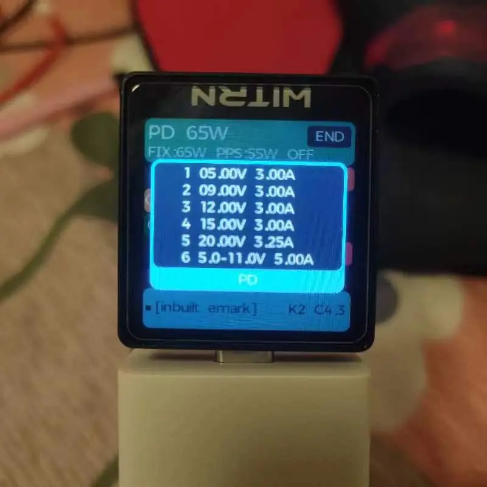
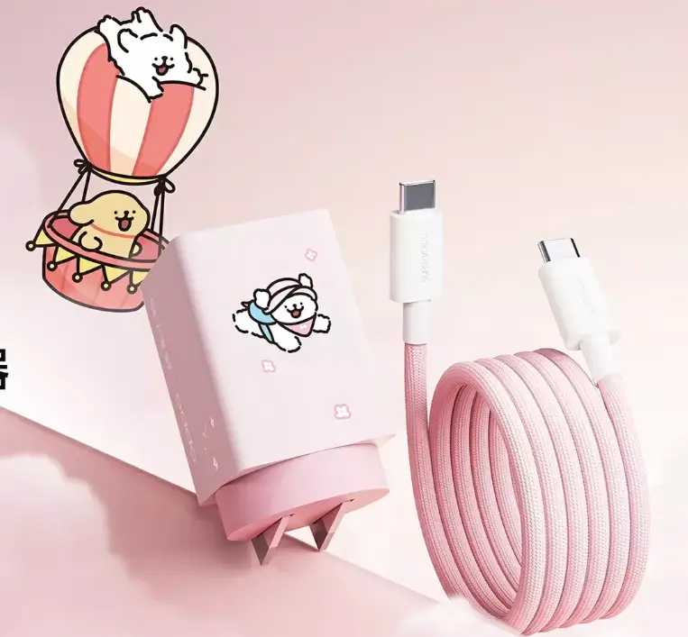

# OPPO小方瓶氮化镓充电器

<!--more-->

买这款的主要原因还是搭配着 [充电宝](/posts/untpxpv/) 进行使用。原装手机充电头只支持 65W SuperVooc 私有协议快充，其他设备一律 5V1A 根本无法使用。绿厂系也出过几个支持 PPS 多口充电头，不过体积有点大不太方便携带。这款就很小巧，插脚也能进行折叠，放在包里还是兜里都没有太多的负担，下面就大致的概述下。

## 外观

外观圆方结合的设计给人高度没那么高的视觉感受，圆型部分以卡其色涂色设计，没有换皮一加款那么性冷淡。尺寸为 33.5\*33.5\*56mm，插脚可折叠设计在折叠过程中有一定的阻力，手感很好。整体摸起来很舒服，没有油腻感。前后有 OPPO、100GAN 的深压变色文字。

自带一款具有磁力效果 1m ctc 数据线，估计是时间放久的原因，表皮有点发黄并且出现了点点锈迹，不过之影响观感不影响使用。
## 协议支持度

这款氮化镓充电器对于私有协议和公有协议支持度还算可以，无论是自家 100W SuperVooc 私有协议，还是 65W PD 协议，55W PPS 协议，亦或是国内快充协议 UFCS 44W 都进行支持，多设备出门或旅行带一个插头就能解决。



## 总结

目前来说绿厂系出品的性价比较为高的一款充电头，功率释放还是协议支持都做到了很棒的程度，相对于之前出品的充电头来说各有取舍。前几天出了一款联名套装，将 PD 功率拉到了 100W，不过相较于 229 的价格，目前来看不是很可以。

---

> 作者: bulone  
> URL: https://blog.toastbubble.top/posts/0hd8aqy/  

