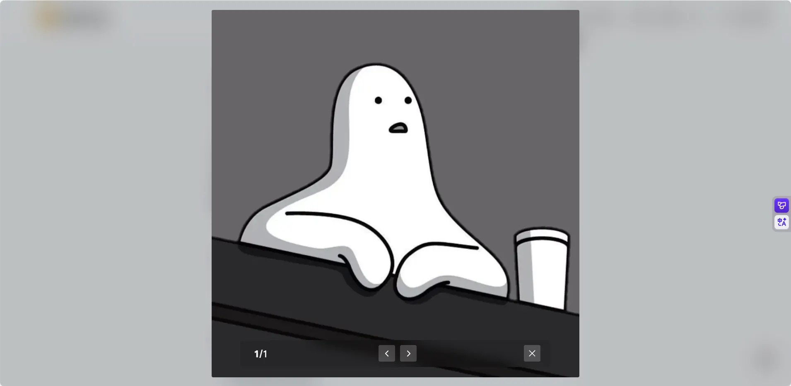

# 另类说说页


<!--more-->

想在博客内增加说说页面，看了网上解决方案一种是动态的类说说程序加载到博客内，一种是创建一个单独的页面，说说数据文件读取加载到数据内。前者能够随时随地任何设备上进行编写，后者好像也行不过发布时需要每次部署。当然攒着也行有新文章发布时一起推送部署。

前者常见的 Memos，Monments，Artitalk 等，尝试使用不过部分需要 Docker 部署那么就要有对应的服务器去运行了，如果家庭有设备也可以进行内网穿透。考虑了一下还有一个麻烦的点在图片的存储位置，也需要对应的存储空间去进行，所以 Pass 了。

再来说后者，一般需要创建一个单独的 yml 文件，每次将对应的内容添加到文件内。这种方案确实简单，跟发文章没什么区别。但是我使用的时 Obsidian 每次编写的内容，只支持打开 md 后缀文件，对于其他后缀文件还需要用其他程序打开编辑，能在一个软件内完成的还是尽量在一个软件内完成，Pass。

后面突发奇想，说说和时间线没多大区别，都是发布一些短内容，那么模仿着创建一个对应的然后在对每个区块进行渲染那不就是说说了🤗，说干就问 Deepseek，开整。

首先模仿着在 layout/\_markup 文件夹内创建 render-codeblock-tzone.html 文件，用于识别编译 mdrkdown 中的对应代码块。然后在 partial/plugin/tzone.html 编写对应布局代码，读取内容然后渲染到页面上。最后在 conten 目录夹内增加 tzone.md 添加对应内容网页访问就行。

  
{}
```html
{{- dict
  "Options" .Attributes
  "Inner" .Inner
  "Resources" .Page.Resources
  "Position" .Position
  | partial "plugin/tzone.html"
-}}
```
{}  
{}
```html
{{- /* layouts/partials/plugin/tzone.html */ -}}
{{- /* TZone support for code fences extended and shortcodes. */ -}}
{{- $data := .Options.data -}}
{{- $file := .Options.file -}}
{{- $avatar := .Options.avatar | default "/avatar.webp" -}}
{{- $author := .Options.author | default site.Params.author.name -}}
{{- $showDate := .Options.showDate | default true -}}
{{- $showAddress := .Options.showAddress | default true -}}
{{- $showLink := .Options.showLink | default true -}}
{{- $layout := .Options.layout | default "default" -}}

{{- /* Get TZone posts */ -}}
{{- $content := .Inner -}}
{{ with $data }}
  {{- $content = index site.Data.tzone (printf "%v.%v" . page.Language) | default (index site.Data.tzone .) -}}
  {{- if not $content -}}
    {{- warnf "TZone: data not found, please ensure the data file \"data/tzone/%s.{json|yml|yaml|toml}\" exists." . -}}
  {{- end -}}
{{- else -}}
  {{- with dict "Path" $file "Resources" .Resources | partial "function/resource.html" }}
    {{- $content = .Content -}}
  {{- else with $file -}}
    {{- warnf "TZone: no such data file: %s" . -}}
  {{- end -}}
  {{- $content = $content | transform.Unmarshal -}}
{{- end -}}

{{- $posts := $content.posts | default slice -}}
{{- with .Posts -}}
  {{- $posts = . -}}
{{- end -}}
{{- $posts = sort $posts "date" "desc" -}}
{{- if not $posts -}}
  {{- warnf "TZone: posts is empty, executing in file %s" $.Position -}}
{{- end -}}

{{- /* 分页设置 */ -}}
{{- $pageSize := 10 -}}
{{- $initialPosts := first $pageSize $posts -}}
{{- $remainingPosts := after $pageSize $posts -}}
{{- $hasMore := gt (len $remainingPosts) 0 -}}


<div class="tzone-container {{ $layout }}">
  {{- /* 初始显示的帖子 */ -}}
  <div class="tzone-initial-posts">
    {{- range $post := $initialPosts -}}
      {{- if or $post.content (gt (len ($post.images | default slice)) 0) $post.link $post.video -}}
        <div class="tzone-item">
          <!-- Header -->
          <div class="tzone-header">
            
            <div class="info">
              <span class="author-name">@{{ $author }}</span>
              {{ if and $showDate $post.date }}
                {{ $dateStr := replace $post.date "年" "-" }}
                {{ $dateStr = replace $dateStr "月" "-" }}
                {{ $dateStr = replace $dateStr "日" "" }}
                {{ $dateStr = replace $dateStr "点" ":" }}
                {{ $dateStr = replace $dateStr "分" ":00" }}
                {{ $parsedDate := $dateStr | time.AsTime }}

                {{ $now := now }}
                {{ $today := $now.Format "2006-01-02" }}
                {{ $yesterday := $now.AddDate 0 0 -1 | time.Format "2006-01-02" }}
                {{ $postDate := $parsedDate.Format "2006-01-02" }}
                {{ $postYear := $parsedDate.Format "2006" }}
                {{ $currentYear := $now.Format "2006" }}

                {{ $displayDate := "" }}

                {{ if eq $postDate $today }}
                  {{ $displayDate = printf "今天 %s" ($parsedDate.Format "15:04") }}
                {{ else if eq $postDate $yesterday }}
                  {{ $displayDate = printf "昨天 %s" ($parsedDate.Format "15:04") }}
                {{ else if eq $postYear $currentYear }}
                  {{ $displayDate = $parsedDate.Format "01-02 15:04" }}
                {{ else }}
                  {{ $displayDate = $parsedDate.Format "2006-01-02 15:04" }}
                {{ end }}


                <span class="date">{{ $displayDate }}</span>
              {{ end }}
            </div>
          </div>

          <!-- Content -->
          {{ with $post.content }}
            <p class="tzone-content">{{ . | markdownify }}</p>
          {{ end }}


          <!-- Images -->
          {{- $validImages := slice -}}
          {{ with $post.images }}
            {{ range . }}
              {{ if and . (ne . "") (ne . " ") }}
                {{ $validImages = $validImages | append . }}
              {{ end }}
            {{ end }}
          {{ end }}

          {{ if gt (len $validImages) 0 }}
            <div class="images-container images-count-{{ len $validImages }}">
              {{ range $imagePath := $validImages }}
                
              {{ end }}
            </div>
          {{ end }}
        </div>
      {{- end -}}
    {{- end -}}
  </div>

  {{- /* 加载更多区域 */ -}}
  {{ if $hasMore }}
    <div class="tzone-load-more-area">
      <button class="tzone-load-more-btn" onclick="window.tzoneLoadMore(this)">
        <span class="btn-text">加载更多</span>
        <span class="loading-spinner" style="display: none;">加载中...</span>
      </button>
      <div class="tzone-remaining-count">
        还有 {{ len $remainingPosts }} 条内容
      </div>
    </div>

    {{- /* 隐藏的剩余帖子数据 */ -}}
    <div id="tzone-remaining-data" style="display: none;">
      {{ $remainingPosts | jsonify }}
    </div>
    <div id="tzone-config-data" style="display: none;">
      {{ dict
        "avatar" $avatar
        "author" $author
        "showDate" $showDate
        "showAddress" $showAddress
        "showLink" $showLink
        | jsonify
      }}
    </div>
  {{ end }}
</div>

<script>
  document.addEventListener("DOMContentLoaded", function () {
    // 初始化初始图片的 ViewImage
    function initViewImage() {
      if (window.ViewImage) {
        ViewImage.init(".tzone-image");
      }
    }

    // 页面加载完成后立即初始化
    initViewImage();
  });
</script>

{{ if $hasMore }}
  <script>
    // 使用简单的全局函数，避免复杂的事件监听器管理
    window.tzoneLoadMore = function (button) {
      // 防止重复点击
      if (button.disabled) return;

      const container = button.closest(".tzone-container");
      const postsContainer = container.querySelector(".tzone-initial-posts");
      const remainingDataEl = document.getElementById("tzone-remaining-data");
      const configDataEl = document.getElementById("tzone-config-data");
      const remainingCount = container.querySelector(".tzone-remaining-count");
      const btnText = button.querySelector(".btn-text");
      const spinner = button.querySelector(".loading-spinner");

      if (!remainingDataEl) return;

      // 禁用按钮
      button.disabled = true;
      btnText.style.display = "none";
      spinner.style.display = "inline";

      // 获取数据
      const posts = JSON.parse(remainingDataEl.textContent);
      const config = JSON.parse(configDataEl.textContent);
      const pageSize = 10;

      // 加载下一批帖子
      setTimeout(() => {
        const postsToShow = posts.slice(0, pageSize);
        const newRemainingPosts = posts.slice(pageSize);

        // 渲染新帖子
        postsToShow.forEach((post) => {
          if (
            post.content ||
            (post.images && post.images.length > 0) ||
            post.link ||
            post.video
          ) {
            const postElement = createPostElement(post, config);
            postsContainer.appendChild(postElement);
          }
        });

        // 更新剩余数据
        remainingDataEl.textContent = JSON.stringify(newRemainingPosts);

        // 更新剩余数量显示
        if (remainingCount) {
          if (newRemainingPosts.length > 0) {
            remainingCount.textContent = `还有 ${newRemainingPosts.length} 条内容`;
          } else {
            remainingCount.textContent = "已加载全部内容";
            button.style.display = "none";
          }
        }

        // 恢复按钮
        button.disabled = false;
        btnText.style.display = "inline";
        spinner.style.display = "none";
      }, 300);
    };

    // 创建帖子元素的函数
    function createPostElement(post, config) {
      const div = document.createElement("div");
      div.className = "tzone-item";

      let html = `
    <div class="tzone-header">
      
      <div class="info">
        <span class="author-name">@${config.author}</span>
  `;

      if (config.showDate && post.date) {
        html += `<span class="date">${post.date}</span>`;
      }

      html += `</div></div>`;

      if (post.content) {
        html += `<p class="tzone-content">${post.content}</p>`;
      }

      // 处理图片
      if (post.images && post.images.length > 0) {
        const validImages = post.images.filter(
          (img) => img && img !== "" && img !== " ",
        );
        if (validImages.length > 0) {
          html += `<div class="images-container images-count-${validImages.length}">`;
          validImages.forEach((imgPath) => {
            html += ``;
          });
          html += "</div>";
        }
      }

      div.innerHTML = html;
      return div;
    }
  </script>
{{ end }}
```
{}  


使用方法就是普通代码块后面增加 tzone，内部格式如下。content 中支持 markdown 格式  
```yaml
posts:
  - content: " 简易说说页面搭建完成。"  
    date: 2025 年 11 月 21 日 11 点 11 分  
    images: 
      - /avatar.webp
```

采取的策略是每次页面显示十条说说，避免太多导致页面卡顿。该页面的图片使用 ViewImageJS 库，因为 lightgallery 库打开后底部将所有图片缩略图都显示出来很杂。在主题配置中增加对应库链接，js 代码在上述 html 代码中有体现。  


感觉这种方案会增加性能消耗，加载此页面笔记本的风扇呼呼的转，后续如果有问题在采用其他方案吧，毕竟数据资源都在本地也好进行转移操作。🥱


---

> 作者: bulone  
> URL: https://blog.toastbubble.top/posts/0vtdshi/  

