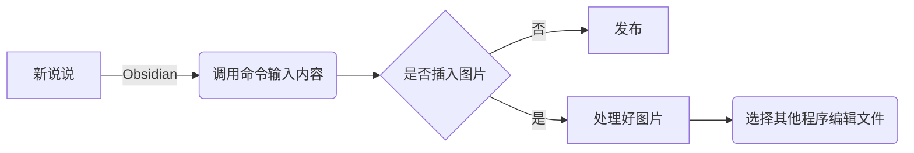
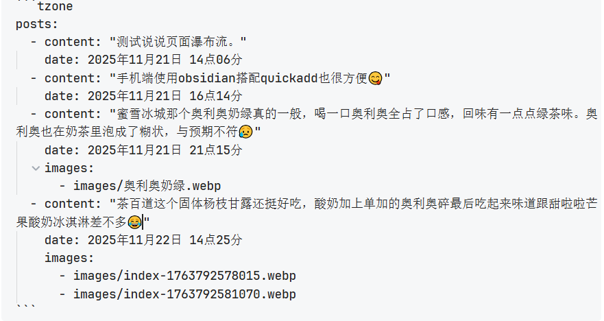
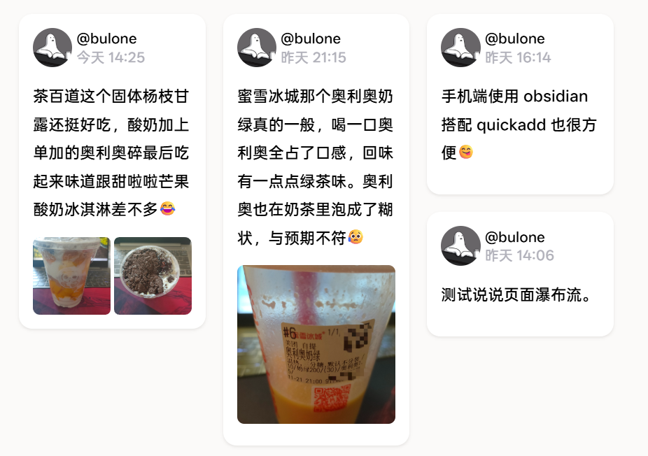

# Hugo另类说说页

<!--more-->
在博客里面增加一个类似说说/朋友圈的页面。在网上搜索相关教程一部分时类似友链那种，将对应的数据单独存放到如.toml/.yml/.json 中，然后创建单独的模板在进行读取渲染。另一部分是通过可用平台或者服务器搭建在线对应程序，比如 Memos，Moments 等程序。毕竟我都搭建静态博客了，当然我也没有服务器之类的，爪云免费区也因为人太多导致新建容器都是错误。看向 Cloudflare Worker，最后也是因为各种问题放弃了。

静态单独模板吧，需要创建一个单独的文件来进行编辑，在 obsidian 中用 quickadd 插件调用 js 文件也能直接插入文本内容，但是对于如果需要增加图片链接的情况下就要用另一个文件去进行编辑。说说类是能够尽量简易发布，最好不利用电脑，所以在手机上这一系列步骤就有些许繁琐了。



思考之下，说说不就是另类的时间线吗，该主题配有时间线的 codeblock/shortcode，只要在文档中调用就行。那么模仿着创建类似的文件去读取渲染直接就可以直接在文档中去编辑相关内容。在手机上就可以直接不调用其他软件的情况下完成增加说说内容，导入图片并压缩处理，增加图片链接一气呵成。最后在通过第三方 Git 软件同步即可，后续每次发说说就不用那么麻烦了。  

目前支持内容 markdown 渲染，图片根据数量进行排版。页面上的说说项目在不同宽度上对应显示效果不同，支持瀑布流。  

不过这样使用不知道有没有性能上的损耗，目前内容也不太多可能体现不出来，后面如果真影响加载还是转用其他方式吧。目前这种做法所有文件都存在本地不会丢失，后续转移方面也很方便。

所有的页面代码都是利用 Deepseek 进行生成然后在对应修改，不得不说 AI 对于一个小白来说解决了很多问题，像之前都是直接搜然后一点点对应修改有点浪费时间。最后点击 [T空间](/tzone) 进行概览吧。

因为对于修改的内容有点杂，所以代码部分就不放出来了，如果有需求的话可以评论留言，将参与到的部分内容发送到您的**邮箱**里面，后续自己参照着修改。

---

> 作者: bulone  
> URL: https://blog.toastbubble.top/posts/0vtdshi/  

