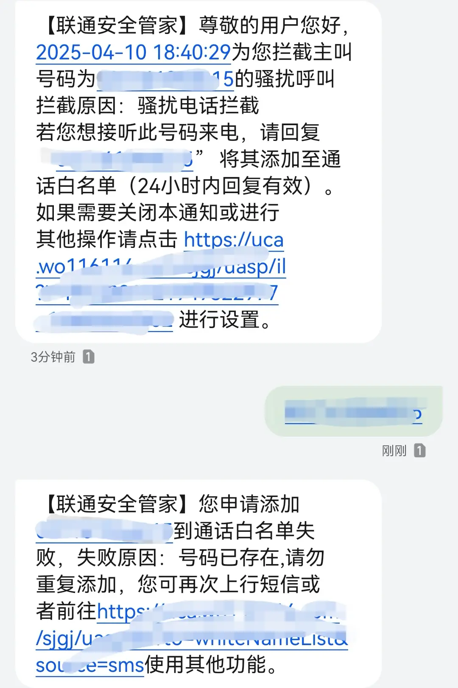
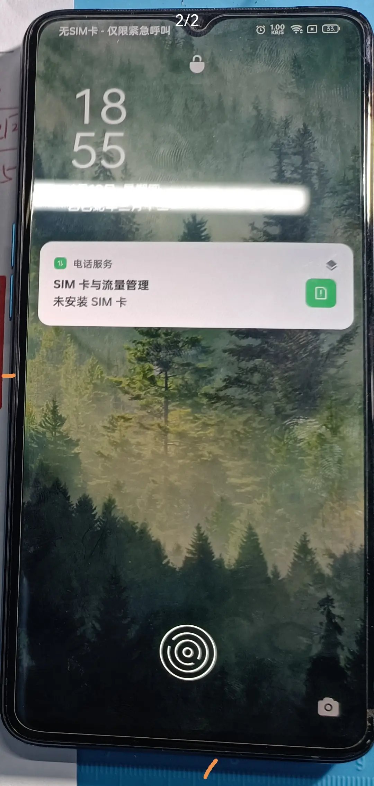

# 手机虚焊

<!--more-->
  
~*[©封面图版权归OPPO公司所有](https://www.oppo.com)*~  


## 问题
第一次听虚焊这个词的时候还是搭载骁龙 888 的某款手机大规模出现问题，没想到竟然发生在了这款搭载骁龙 855Plus 的 Reno Ace 上。出现问题大概是去年的 12 月份，我也不太清楚为什么在冬季会出现了虚焊。当时的主要现象就是充电时玩手机概率出现卡屏然后关机，如果在播放视频时就会出现鸣叫大约十秒左右关机。出现上述现象我就怀疑大概率是手机虚焊了，在酷安话题中也查询到之前其他酷友出现虚焊。当时也并没有太影响使用，避免在充电时玩手机即可，毕竟 65W 的快充和 4000mha 的电池充电速度还是可观的。不过持续到了也就前几天，在正常使用时手机突然关机，充电无反应，强制开机时在开机界面出现花屏无法开机🙃。

## 转机
在论坛上看到 OPPO 河南高级维修中心目前有免费维修主板的活动，只是不保证是否能够维修成功，也就是尽最大可能去维修。我尝试拨打了其客服电话，询问活动是否还存在，答复是可以寄过去诊断，直接在公众号上申请寄修服务，夸夸 OPPO 的服务寄修双向免费🥰。

## 过程
毕竟离得近隔天就到了，期间还会打电话询问问题所在和解决方案。哎呀如果手机卡开了骚扰拦截的（运营商方面），记得在对应的公众号里面看看有没有被拦截，寄过去三天客服每天都在打电话全都被运营商方面拦截了，最后逼得客服用私人号码打的叫回拨😥，真不是故意的。点名批评联通的骚扰拦截，没开短信提醒公众号里面也没有推送通知，下午把客服中心号码加入白名单还是被拦截🙄，问客服客服也没啥子主意，后面有手动开启短信提醒了。  

## 总结

手机完美亮屏🎉，OPPO 售后服务总体很完美，在服务公众号还能看到相应的维修测试过程图片，虽然不多，但很专业，下一部还是选择 OPPO。  

---

> 作者: bulone  
> URL: https://blog.toastbubble.top/posts/6he9mly/  

