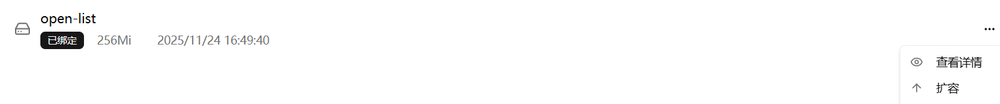
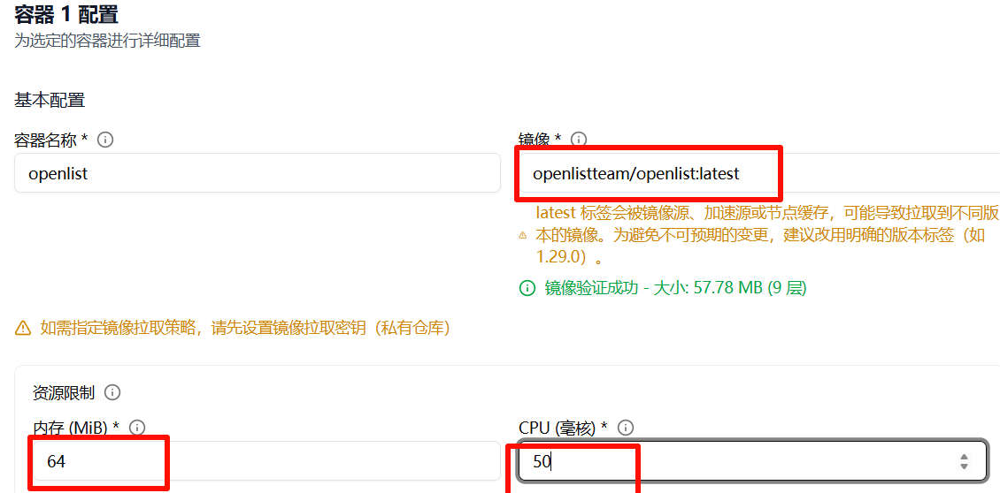
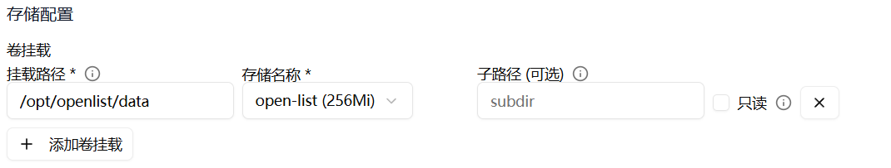
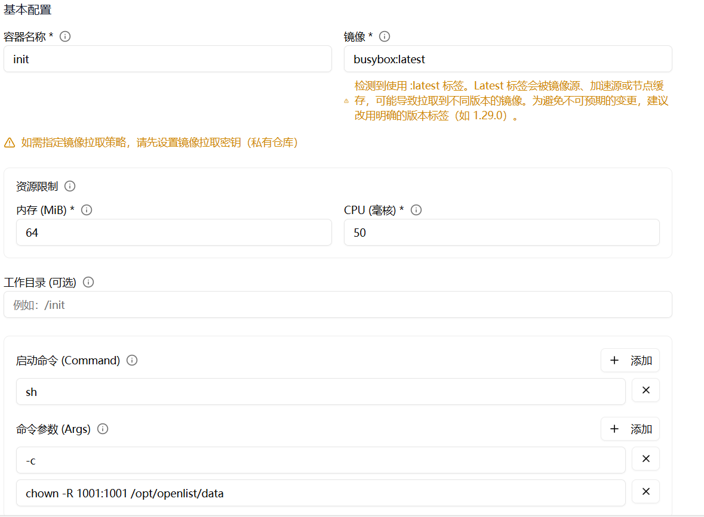
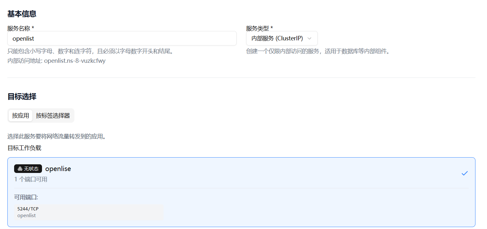
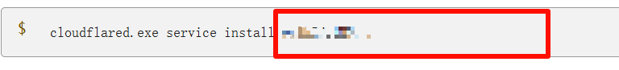
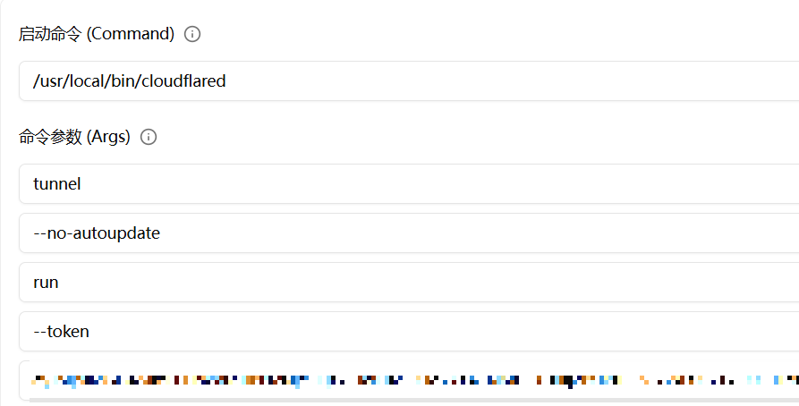
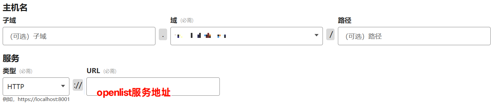

# 在Leaflow上部署Openlist

<!--more-->
## 前言
Leaflow 是类似于 ClawCloud 的容器部署平台，目前在内测阶段，跟当初 [爪云]^(ClawCloud) 一样注册用户赠送 5 元余额。当初注册爪云只是为了搭建 Openlist 的做 Webdav 观影平台，后续用户激增导致访问断断续续，直到几个月前访问部署的网站时出现 not healthy 等字样，换区域部署依旧是该现状最后就删除了部署的所有内容。

十月份左右在 L 站看到了类似平台 Leaflow，也能够部署 docker 容器。只不过错过了当时的宣传期，新用户没有邀请码则无法注册。不过通过万能的“黑市”闲鱼，花了 3￥就能获得一个新鲜的邀请码注册上了。

## 部署
1. 存储管理 - 创建存储卷；对于 openlist 来说不需要太大的存储空间，256Mi 即可。  
   
2. 应用管理 - 新建应用。如图所示，镜像填入 `openlistteam/openlist:latest`，资源限制和 CPU 看着填，没必要太大。  
   
3. 网络配置设置暴露端口为 5244。
4. 挂载路径 `/opt/openlist/data`，存储名称选择第一步所创建的存储卷。  
   
5. 添加 Init 容器，对应所需参数如图；  
   镜像：`busybox:latest`  
   内存：`64`，CPU：`50`  
   启动命令：`sh`  
   命令参数：`-c` `chown -R 1001:1001 /opt/openlist/data`  
   存储配置与第 4 步一致。  
     
### 问题
第一次安装时如果没有设置密码 Openlist 的密码时随机，重新设置密码进入Leaflow服务管理-对应容器-进入终端，设置密码输入 `./openlist admin set 密码`
## 域名绑定
利用 Cloudflare Tunnel 内网穿透绑定无备案域名。
1. 服务管理 - 创建服务，选择刚才新建的 openlist 应用，创建完成后复制访问地址。  
   
2. 在 [Tunnel \| Zero Trust 应用连接器 \| Cloudflare](https://www.cloudflare-cn.com/products/tunnel/) 新建隧道，复制 token  
   
3. 在 Leaflow 中创建应用。  
   镜像：`cloudflare/cloudflared:latest`  
   启动命令：`/usr/local/bin/cloudflared`  
   命令参数：`tunnel` `--no-autoupdate` `run` `--token` `您的token`  
   
4. 网络配置新增端口设置 80，之后创建即可。
5. 返回 Cloudflare Tunnel，如图填入第一步的访问地址，第一行为您配置的域名。  
   
6. 配置完成后访问您的域名即可。
## 参考
1. :(fa-solid fa-water-ladder):  [leaflow部署openlist - Linux.do](https://linux.do/t/topic/1112576)
2. :(fa-solid fa-water-ladder): [leaflow不能绑定没备案的个人域名吗？- Linux.do](https://linux.do/t/topic/1047341/3)  
~\*:(fa-solid fa-water-ladder): 链接需要特殊访问~

---

> 作者: bulone  
> URL: https://blog.toastbubble.top/posts/8fvzly4/  

