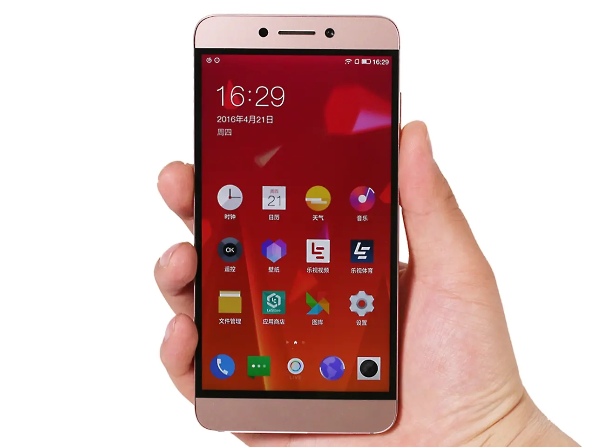
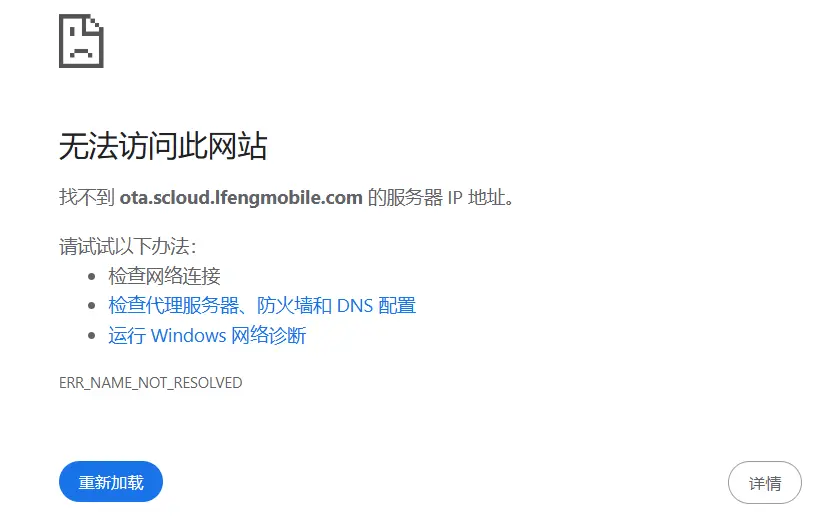
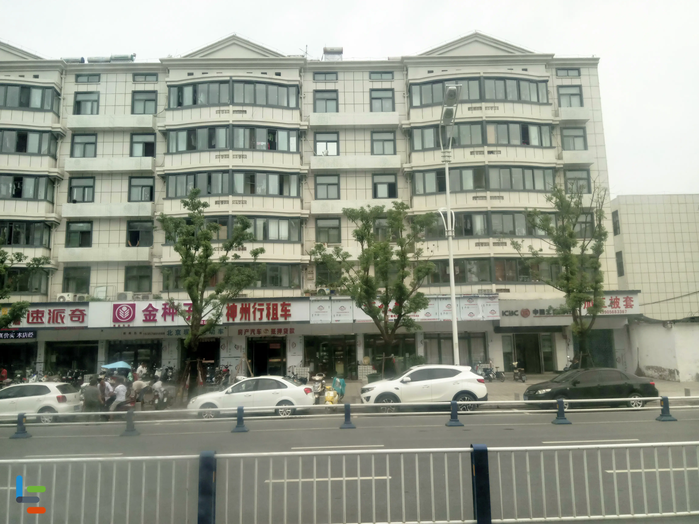
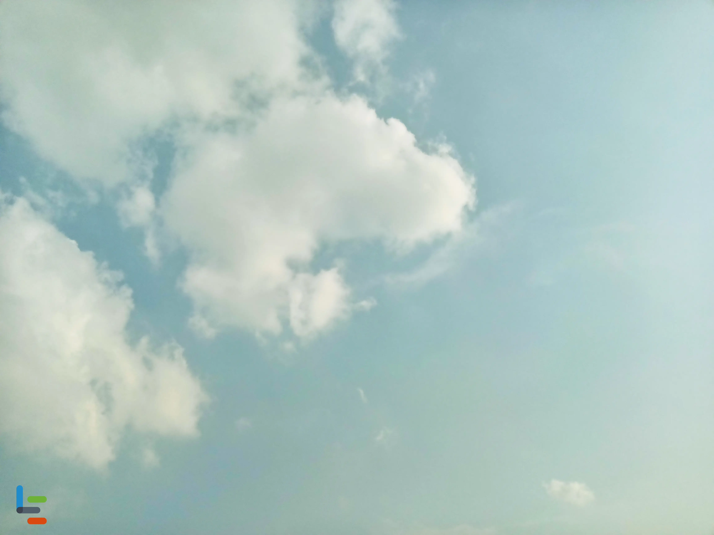

# 我的第一部手机

<!--more-->

~[图片©中关村在线](https://baike.baidu.com/pic/%E4%B9%90%E8%A7%86%E8%B6%85%E7%BA%A7%E6%89%8B%E6%9C%BA2/19450924/5555703513/9345d688d43f8794a4c29f24074219f41bd5ad6e8c3d?fr=newalbum&fromModule=album#aid=5555703513&pic=3812b31bb051f81986182b410fed5ded2e738bd4493c)~


在酷安上看到「我的第一步手机」话题，突然就想起了之前的真正属于我的第一部智能手机乐视 2X620。在拥有该手机之前，一直都在用我爸淘汰下来的手机，什么按键机、按键触摸机、杂牌智能机、大可乐 2 等等。这些手机好像也是印证了时代手机的发展方向。高中毕业后手机借给高中同学使用后续没还，所以一些内容都是凭借记忆去描述。

中考后，我爸在网上给我买了这部乐视 2 手机，那是 16 年。那时候的魅族还如日中天，小米利用互联网发展也风声水起，OV 也凭借着综艺赞助深入人心。我是没有想到我爸会给我买乐视这个品牌，第一次听见乐视赞助的湖南台「全员加速中」，在节目里嘉宾是不是掏出手机完成任务各种展示手机功能。那个时候乐视的各种资源仿佛还是十分雄厚的。

跑偏了，还是说回手机。拿到手的时候整个手机盒子很大很白很简约，正因为宽所以手机和很 " 薄 "。打开后里面的东西也很平平无奇，除了赠送送的 Type-C 转 3.5MM 线。乐视在我印象里应该是国产第一个做 Typec 接口的手机，这点好评是不错，可是它把 3.5MM 接口砍了，虽有赠送的转接线，不能边充电边听歌也是些许遗憾，那时候的蓝牙耳机发展还是初始阶段。图先欠着。  
  

发布会大吹特吹的 ID 无边框在手机打开后俨然成为了一种笑话。两边超宽的边框仿佛能停下航母，这块屏幕也只有在息屏时才能体现一体化的美感。这部手机整体后盖的金属散热时也挺烫手的。方正的外观，边角些许弧度，握在手里似板砖，可是与我表弟差不多厚度的边角圆弧观感差距大，手持感也大。现在直角边框又开始燃起火苗，各大手机厂商排队进入。  

这个手机系统 EUI 是真逆天，不知道是不是对 MTK 调教的问题，打游戏时只要电量低于 20% 帧率就会掉到能玩的水平，眨眼补帧，接上电源又恢复如初。现在想起或许是电压问题？可是也就一年时间不到就这样了。[官网](https://bug.le.com/cn/download/phone) 还有系类展示，不过下载链接已经挂了。  

在这个手机上还花过不应该花的费用，那时候的我还十分的年轻，沉醉于酷安的刷机浪潮中，在此期间还将手机刷坏过一次，无法开机且刷不进包，到~~售后~~竟然收了我 50 大洋（太可恶了）。

三年使用下来，只能说这手机能用但不多。乐视 2 的时候，其也刚布局手机行业没几年，贾总模仿小米的销售思路销量也是可观。发布会上的生态化反，最后到头来步步败退。

最后，贾总下周回国吗？

|  |  |
| ----------------------------------------------- | ----------------------------------------------- |


~*估计是保存在网盘里没原图上传现在都发绿了~


---

> 作者: 吐司气泡  
> URL: https://blog.toastbubble.top/posts/9avfttm/  

