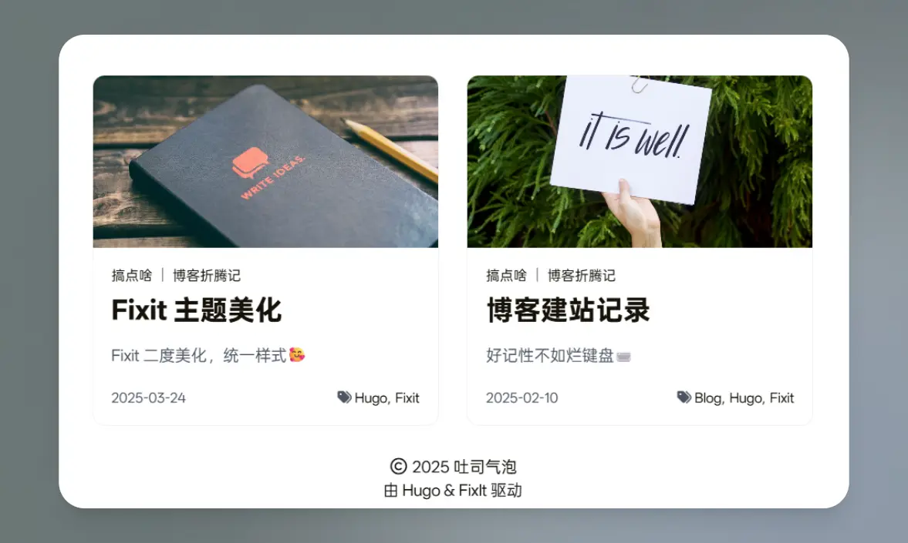
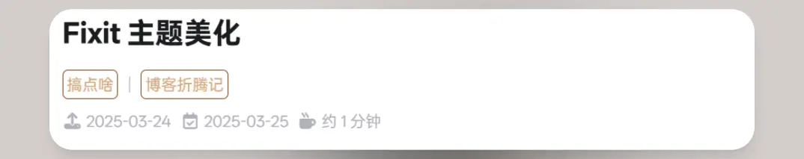
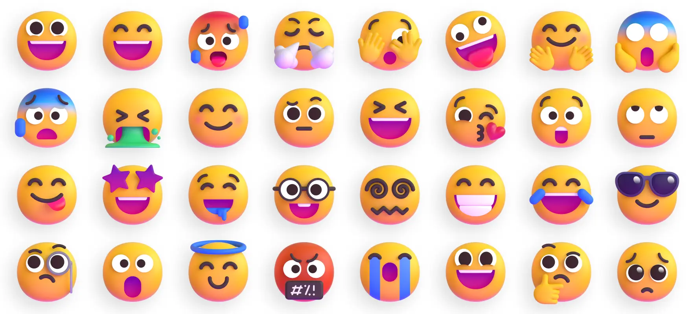
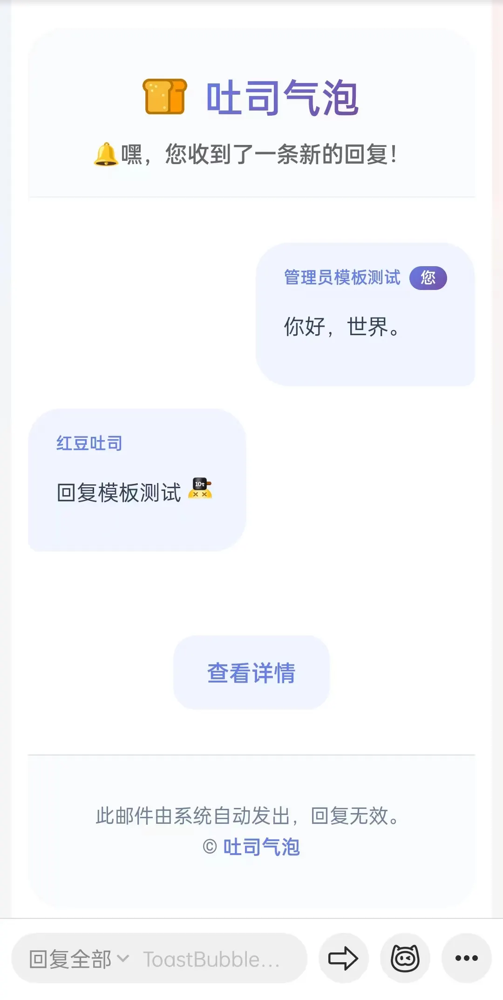
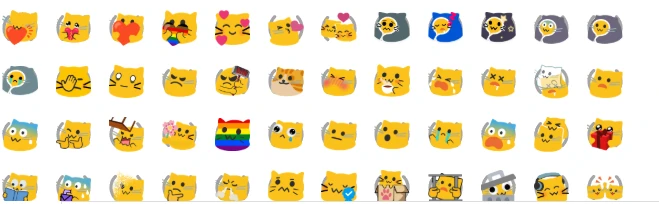

# Fixit主题美化


<!--more-->
==本文章代码部分内容使用 AI 辅助创作==[danger]

安装博客也一月有余，期间也拜访过其他博客站，当然是因为搜索知识进行拜访。对于主题的一些内容进行自定义并完善。

**注：涉及到 html 修改部分请将所需修改文件复制一份到主题外相同位置，修改后既能应用也能不破坏原主题文件。**

## CSS 样式
对于主题 CSS 参数，可以在 `assets/css` 中创建 `_override.scss` 进行设置，会进行覆盖。  其他样式可以在同文件夹内创建 `_custom.scss` 进行编写。  

本博客使用的是个人免费使用的 [OPPO Sans4.0](https://www.coloros.com/article/A00000074/) 字体，主要喜欢这个字体的数字部分。利用 [中文网字计划网站](https://chinese-font.netlify.app/zh-cn/) 进行字体分包，在使用字体后不影响网站访问速度。
## 首页列表部分

原主题的首页列表部分是每行一个，列排布。没有封面图还好，如果有封面图因为比例显示为 2:1，所以在屏幕上会显得很大，那么一页下来也显示不了几张图片。偶然进入 [Atpx](https://atpx.com/blog/) 的空间，发现其博客页很简约整齐，双列排布文章，每个文章块也很小。所以就借鉴了其样式内容，为了不同宽度设备整个块比例适当，所以也顺势调整了图片的宽高比达到合适程度。  

文件位置：
- layouts/\_default/home.html & summary.html 
- layouts/partials/single/post-included-in.html


## 文章页
主要删除了作者信息，其余未作变化。  
文件位置：layouts/post/single.html



## MSEmoji🎉

  
主题自带有 Twemoji，可以在主题配置文件中选择开启。不过我开启后还是加载失败，所以还是把他关闭了。很喜欢微软的表情，在 Github 上搜索类似 Twemoji 的项目，最终找寻该项目符合。  



**使用方法**：
1. 在配置文档中搜索 `params.page.library.js`，在其内部添加  
   msemojijs = "https://unpkg.com/msemoji@1.1.2/dist/msemoji.min.js"
2. 创建 `custom.js`，位置在 `assets/js/`
```js
msemoji.parse(document.body,{
    base: "https://gcore.jsdelivr.net/gh/DellZHackintosh/msemoji@1.1.2/src/",
    ext: ".svg", 
    folder: "Color"
  });
```

| base   | ext   | folder |
| ------ | ----- | ------ |
| 表情仓库位置 | 表情拓展名 | 表情所在目录 |

主要这三个参数即可，如果还想要其他参数配置，请参考原文档。

## Waline 评论系统
博客使用的是 Waline，因为就它带有文章 Reaction，可以自定义图片。其他的几个评论系统都大差不差。使用方法请到 [Waline官网](https://waline.js.org/) 配置参数。
### 个性化Waline邮件模板
> 新回复模板

```html {title="MAIL_TEMPLATE"}
<style>.container{max-width:100%;background:#fff;border-radius:24px;overflow:hidden;margin-block:25px}.header{padding:30px 32px 20px;background:#f8fafc;text-align:center;border-bottom:1px solid #f1f3f4}.header-content{display:flex;align-items:center;justify-content:center;gap:12px;margin-bottom:12px}.logo{width:32px;height:32px}.site-name{margin:0;font-size:28px;font-weight:700;background:linear-gradient(135deg,#667eea 0%,#764ba2 100%);-webkit-background-clip:text;-webkit-text-fill-color:transparent;background-clip:text}.notification{color:#666;font-size:16px;font-weight:500}.content{padding-block:32px}.chat-container{display:flex;flex-direction:column;gap:16px}.message{display:flex;max-width:85%}.your-message{align-self:flex-end}.reply-message{align-self:flex-start}.bubble{padding:16px 20px;border-radius:24px;line-height:1.5;font-size:15px}.your-bubble{background:#f0f4ff;color:#334155;border-bottom-right-radius:8px}.reply-bubble{background:#f0f4ff;color:#334155;border-bottom-left-radius:8px}.user-info{font-size:12px;margin-bottom:6px;font-weight:600}.your-message .user-info{color:#667eea}.reply-message .user-info{color:#667eea}.you-tag{background:linear-gradient(135deg,#667eea 0%,#764ba2 100%);color:#fff;padding:2px 8px;border-radius:10px;font-size:11px;margin-left:6px}.action{text-align:center;margin-top:60px}.btn{display:inline-flex;align-items:center;gap:8px;padding:16px 24px;background:#f0f4ff;color:#667eea;text-decoration:none;border-radius:16px;font-weight:600;font-size:16px;transition:all .3s ease}.btn:hover{transform:translateY(-2px);box-shadow:0 8px 25px rgba(102,126,234,.4)}.footer{padding:32px;text-align:center;background:#f8fafc;color:#718096;font-size:14px;line-height:1.6;border-top:1px solid #e2e8f0}.footer a{color:#667eea;text-decoration:none;font-weight:600}.wl-emoji{display:inline-block;vertical-align:baseline;height:1.25em;margin:-.125em .25em}</style><div class=container><div class=header><div class=header-content> <h1 class=site-name>{{site.name|safe}}</h1></div><div class=notification>🔔嘿，您收到了一条新的回复！</div></div><div class=content><div class=chat-container><div class="message your-message"><div class="bubble your-bubble"><div class=user-info>{{parent.nick|safe}}<span class=you-tag>您</span></div><div class=message-text>{{parent.comment|safe}}</div></div></div><div class="message reply-message"><div class="bubble reply-bubble"><div class=user-info>{{self.nick|safe}}</div><div class=message-text>{{self.comment|safe}}</div></div></div></div><div class=action><a href={{site.postUrl}} class=btn>查看详情</a></div></div><div class=footer>此邮件由系统自动发出，回复无效。<br />©️ <a href={{site.url}}>{{site.name|safe}}</a></div></div>
```

> 管理员新评论模板
```html {title="MAIL_TEMPLATE_ADMIN"}
<style>.container{max-width:100%;background:#fff;border-radius:24px;overflow:hidden;margin-block:25px}.header{padding:30px 32px 20px;background:#f8fafc;text-align:center;border-bottom:1px solid #f1f3f4}.header-content{display:flex;align-items:center;justify-content:center;gap:12px;margin-bottom:12px}.logo{width:32px;height:32px}.site-name{margin:0;font-size:28px;font-weight:700;background:linear-gradient(135deg,#667eea 0%,#764ba2 100%);-webkit-background-clip:text;-webkit-text-fill-color:transparent;background-clip:text}.notification{color:#666;font-size:16px;font-weight:500}.content{padding-block:32px}.chat-container{display:flex;flex-direction:column;gap:16px}.message{display:flex;max-width:85%}.your-message{align-self:flex-end}.reply-message{align-self:flex-start}.bubble{padding:16px 20px;border-radius:24px;line-height:1.5;font-size:15px}.your-bubble{background:#f0f4ff;color:#334155;border-bottom-right-radius:8px}.reply-bubble{background:#f0f4ff;color:#334155;border-bottom-left-radius:8px}.user-info{font-size:12px;margin-bottom:6px;font-weight:600}.your-message .user-info{color:#667eea}.reply-message .user-info{color:#667eea}.you-tag{background:linear-gradient(135deg,#667eea 0%,#764ba2 100%);color:#fff;padding:2px 8px;border-radius:10px;font-size:11px;margin-left:6px}.action{text-align:center;margin-top:60px}.btn{display:inline-flex;align-items:center;gap:8px;padding:16px 24px;background:#f0f4ff;color:#667eea;text-decoration:none;border-radius:16px;font-weight:600;font-size:16px;transition:all .3s ease}.btn:hover{transform:translateY(-2px);box-shadow:0 8px 25px rgba(102,126,234,.4)}.footer{padding:32px;text-align:center;background:#f8fafc;color:#718096;font-size:14px;line-height:1.6;border-top:1px solid #e2e8f0}.footer a{color:#667eea;text-decoration:none;font-weight:600}.wl-emoji{display:inline-block;vertical-align:baseline;height:1.25em;margin:-.125em .25em}</style><div class=container><div class=header><div class=header-content> <h1 class=site-name>{{site.name|safe}}</h1></div><div class=notification>🔔嘿，您收到了一条新评论！</div></div><div class=content><div class=chat-container><div class="message reply-message"><div class="bubble reply-bubble"><div class=user-info>{{self.nick|safe}}</div><div class=message-text>{{self.comment|safe}}</div></div></div></div><div class=action><a href={{site.postUrl}} class=btn>查看详情</a></div></div><div class=footer>此邮件由系统自动发出，回复无效。<br />©️ <a href={{site.url}}>{{site.name|safe}}</a></div></div>
```

添加到环境变量内，如果环境变量设置的url带https://，那么模板中不需要添加，反之添加，总之视情况而定。





## 照片懒加载背景图问题

产生原因：因为图片设置懒加载属性，css 文件中针对该属性增加加载 loading 背景图片，导致即使加载完成后依旧显现。对于大图片还好，loading 加载图片尺寸不大，因此会被遮挡，小图片就会出现上述现象。  
解决方案：增加 js 判断是否加载完成，完成后移除该属性。  
```javascript
/**
 * 懒加载图片处理器
 * 监控懒加载图片的加载状态，完成后移除loading="lazy"属性
 */
class LazyImageHandler {
    constructor() {
        this.init();
    }

    init() {
        this.processExistingImages();
        this.setupMutationObserver();
    }

    /**
     * 处理现有图片
     */
    processExistingImages() {
        const lazyImages = document.querySelectorAll('img[loading="lazy"]');
        
        lazyImages.forEach(img => {
            // 如果图片已经加载完成（来自缓存）
            if (img.complete) {
                this.markAsLoaded(img);
                return;
            }
            
            // 监听加载事件
            img.addEventListener('load', () => this.markAsLoaded(img), { once: true });
            img.addEventListener('error', () => this.markAsLoaded(img), { once: true });
        });
    }

    /**
     * 设置轻量级MutationObserver监听新图片
     */
    setupMutationObserver() {
        const observer = new MutationObserver((mutations) => {
            for (const mutation of mutations) {
                for (const node of mutation.addedNodes) {
                    if (node.nodeType === 1) {
                        // 直接是图片元素
                        if (node.tagName === 'IMG' && node.getAttribute('loading') === 'lazy') {
                            this.handleNewImage(node);
                        }
                        // 容器内的图片
                        if (node.querySelector) {
                            const newImages = node.querySelectorAll('img[loading="lazy"]');
                            newImages.forEach(img => this.handleNewImage(img));
                        }
                    }
                }
            }
        });

        observer.observe(document.body, {
            childList: true,
            subtree: true
        });
    }

    /**
     * 处理新添加的懒加载图片
     */
    handleNewImage(img) {
        if (img.complete) {
            this.markAsLoaded(img);
            return;
        }

        img.addEventListener('load', () => this.markAsLoaded(img), { once: true });
        img.addEventListener('error', () => this.markAsLoaded(img), { once: true });
    }

    /**
     * 标记图片为已加载（核心逻辑）
     */
    markAsLoaded(img) {
        img.removeAttribute('loading');
        img.classList.add('lazy-loaded');
        img.classList.remove('lazy-loading');
    }
}

// 延迟初始化，避免影响首屏加载
if (document.readyState === 'loading') {
    document.addEventListener('DOMContentLoaded', () => {
        setTimeout(() => new LazyImageHandler(), 100);
    });
} else {
    setTimeout(() => new LazyImageHandler(), 100);
}

```
## AOS 动画库

滑动动画库，依赖于 Jquery。  
在 `hugo.toml` 中的 [params.page.library] 加入所需 CSS，Js 文件。然后再 _custom.js 中添加
```js
AOS.init({
	once:true,
	duration: 400,
	delay: 0,
});
```
init 内可以自选参数初始化。
## 相关链接

1. 文章 Reaction 表情：[Animated-Fluent-Emojis](https://github.com/Tarikul-Islam-Anik/Animated-Fluent-Emojis)
2. 辅助生成样式代码：[Deepseek](https://www.deepseek.com)
3. AOS 动画库使用：[前端炫酷的动画效果库--AOS使用详解\_aos-easing-CSDN博客](https://blog.csdn.net/weixin_45277161/article/details/112302569)
4. AOS 动画库插件：[插件 ｜ AOS 滚动动画库aos.js - 掘金](https://juejin.cn/post/7018850667653496839)

---

> 作者: 吐司气泡  
> URL: https://blog.toastbubble.top/posts/aa6eb19/  

