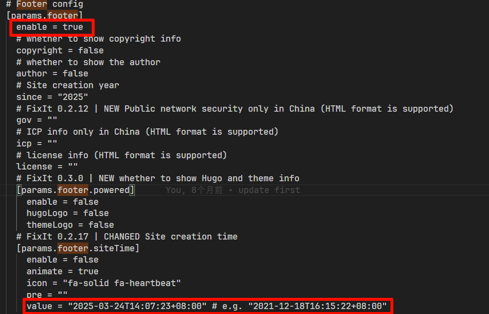
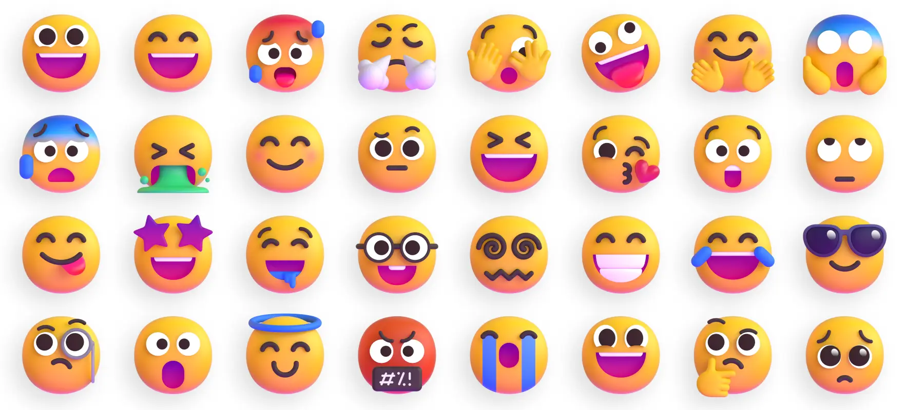

# Fixit主题美化


<!--more-->
==本文章代码部分内容由 Deepseek 生成修改==[primary]

> [!note] 提示
> 1. 自定义 css 文件命名 `_custom.scss`，放置在 `根目录\assets\css\_custom.scss`
> 2. 覆盖原主题变量 css 文件命名 `_override.scss`，放置在 `根目录\assets\css\_override.scss`
> 3. 自定义 js 文件命名 `custom.js`，放置在 `根目录\assets\css\custom.js`
> 4. 对于本文中的 `@include dark-theme` 部分，实在 scss 定义的 mixmin 函数，定义深色模式下的显示效果。
> 
>```scss {.no-header}
>@mixin dark-theme {
>  [data-theme="dark"] & {
>    @content;
>  }
>}    
>```
>5. 文章内部分变量为自定义，请自行更换。
>6. 如果要修改部分模板，复制一份到根目录对应文件夹内。

## 字体
本博客使用的是个人免费使用的 [OPPO Sans4.0](https://www.coloros.com/article/A00000074/) 字体，主要喜欢这个字体的数字部分。利用 [中文网字计划网站](https://chinese-font.netlify.app/zh-cn/) 进行字体分包，在使用字体后不影响网站访问速度。
## 顶部 Header 部分
> 修改内容：未滚动时背景透明，滚动时模糊。  
> 方案：通过 Js 设置滚动时给 Header 部分增加 class 名为 scroll-header，然后在 CSS 中设置对应的样式。

  
{}
```scss
#header-desktop {
    background-color: transparent;
    transition: all 0.3s ease;
    box-shadow: 0 0 0 0px transparent;

    &.scroll-header {
      background-color: rgba(255, 255, 255, 0.75);
      @include dark-theme {
        background-color: rgba(10, 10, 10, 0.75);
      }

      backdrop-filter: blur(6px);
    }
}
```
{}  
{}
```js
const header = document.getElementById('header-desktop');
window.addEventListener('scroll', () => {
  header.classList.toggle('scroll-header', window.scrollY > 1);
});
```
{}  
{}  
详见网站顶部展示效果。  
{}  


## 页尾 Footer 部分
> 修改内容：参考 [可乐君の小站](https://www.kelejun.cn/) 网站页尾增加自定义页尾。  
> 方案： 主题配置中的 footer 部分 enable=true 其他部分全为 false，然后在主题自定义块中 footer 部分增加 `custom/footer.html`。在 `layout\partial\custom\footer.html` 新增文件。



  
{}
```html
<div class="powered-theme-container">
  <div class="powered-container">
    <div class="powered-custom">
      <span>Powered by</span>
      <div class="provide">
        <a href="https://gohugo.io/" title="hugo"
          >{{- dict "Simpleicons" "hugo" | partial "plugin/icon.html" -}}</a
        >
        <a
          href="https://www.cloudflare-cn.com/developer-platform/products/pages/"
          title="Cloudflares pages"
          >{{- dict "Simpleicons" "cloudflarepages" | partial "plugin/icon.html" -}}</a
        >
        <a href="https://github.com" title="Github"
          >{{- dict "Simpleicons" "github" | partial "plugin/icon.html" -}}</a
        >
        <a href="https://obsidian.md/" title="obsidian"
          >{{- dict "Simpleicons" "obsidian" | partial "plugin/icon.html" -}}</a
        >
      </div>
    </div>
    <div class="theme-container">
      <button class="theme-btn" data-theme="light" title="亮色模式">
        <span><i class="fa-solid fa-sun"></i></span>
      </button>
      <button class="theme-btn" data-theme="auto" title="跟随设备">
        <span><i class="fa-solid fa-laptop"></i></span>
      </button>
      <button class="theme-btn" data-theme="dark" title="深色模式">
        <span><i class="fa-solid fa-moon"></i></span>
      </button>
    </div>
  </div>
  <div class="secondary-row">
    <div class="powered-theme">
      <span>Theme by </span>
      <a href="https://github.com/hugo-fixit/FixIt" title="Fixit" class="fixit"
        ><svg
          xmlns="http://www.w3.org/2000/svg"
          viewBox="0 0 512 512"
          width="12"
          height="12"
          style="vertical-align: middle;margin-right:.1rem;margin-bottom:.1rem;"
          fill="currentColor"
        >
          <defs>
            <style>
              .fixit-ban {
                opacity: 0.9;
              }
            </style>
          </defs>
          <path
            d="M159.12 338.69l24.8-16.54a78.87 78.87.0 01-6.77-22.72l-30.88 4.41a16 16 0 01-4.54-31.68l34.27-4.9v-.76l98.94 98.95a76.89 76.89.0 01-71.68-17.73l-26.39 17.59c-.15.11-.31.21-.47.31a16 16 0 01-17.28-26.93zm224.72-48.42a16 16 0 00-13.57-18.11l-34.27-4.9V244.9l34.27-4.9a16 16 0 10-4.54-31.68l-30.54 4.36a79.31 79.31.0 00-6.85-22.85l24.54-16.36a16 16 0 10-17.29-26.93l-.46.31-26 17.34a79.9 79.9.0 00-102.64-3l139.83 139.88 19.41 2.77a16 16 0 0018.11-13.57z"
            class="fixit-bug"
          />
          <path
            d="M256 8C119 8 8 119 8 256s111 248 248 248 248-111 248-248S393 8 256 8zm0 432c-101.46.0-184-82.54-184-184a182.84 182.84.0 0133.38-105.37l256 256A182.86 182.86.0 01256 440zm150.62-78.63-256-256A182.84 182.84.0 01256 72c101.46.0 184 82.54 184 184a182.84 182.84.0 01-33.38 105.37z"
            class="fixit-ban"
          /></svg
        >Fixit</a
      >
    </div>
    <div class="site-running-days">
      <span>
        <a href="/atom.xml" title="Atom订阅" style="margin-right:.3rem;">
          <i class="fa-solid fa-rss" aria-hidden="true"></i> </a
        >在网络宇宙中航行</span
      >
      <span id="run-times">0</span>
      <span>光年</span>
    </div>
  </div>
</div>

<div class="copyright-container">
  <div class="copyright">
    <span><i class="fa-regular fa-copyright"></i></span>
    <span id="run-years"></span>
    <a href="/">吐司气泡</a>
  </div>
  <div class="ccbns4">
    <a
      class="footer-bar-link cc"
      href="https://creativecommons.org/licenses/by-nc-sa/4.0/deed.zh-hans"
      target="_blank"
      title="cc协议"
    >
      <i class="fa-regular fa-copyright"></i>
      <i class="fa-brands fa-creative-commons-by"></i>
      <i class="fa-brands fa-creative-commons-nc"></i>
      <i class="fa-brands fa-creative-commons-nd"></i>
    </a>
  </div>
</div>

{{ $siteTime:= .Site.Params.footer.siteTime }}
<script>
  window.siteConfig = {
    startDate: "{{ $siteTime.value }}"
  };
  const startDate = new Date(window.siteConfig.startDate);


  const updateRunningDays = () => {
    const currentDate = new Date();
    const diffTime = currentDate - startDate;
    const diffDays = Math.floor(diffTime / (1000 * 60 * 60 * 24));
    const startYear = startDate.getFullYear();
    const currentYear = currentDate.getFullYear();
    document.getElementById('run-times').textContent = diffDays.toLocaleString();
    document.getElementById('run-years').textContent =
      startYear === currentYear ? startYear : `${startYear} - ${currentYear}`;
  };
  updateRunningDays();
</script> 
```
~注：{{ $siteTime:= .Site.Params.footer.siteTime }}值得时在主题配置 [params.footer.siteTime] 的 value。  
此处 JS 代码计算运行天数，也就是光年前面的数字。还有 copyright 年份部分。~  
{}  
{}
```scss {title="代码中存在大量自定义变量，请自行更换"}
footer {
  font-size: 12px;
  background: $global-background-color-tertiary;
  text-align: unset;
  padding-left: 1rem;
  padding-right: 5rem;
  margin-top: 1rem;
  a {
    color: $global-font-color-tertiary;
  }
  color: $global-font-color-fourth;
  @include dark-theme {
    background: $global-background-color-tertiary-dark;
    a {
      color: $global-font-color-tertiary-dark;
    }
    color: $global-font-color-fourth-dark;
  }

  .footer-container {
    .powered-theme-container {
      display: flex;
      justify-content: space-between;
      align-items: end;
      border-bottom: 1px solid $global-background-color-fifth;
      @include dark-theme {
        border-bottom: 1px solid $global-background-color-fifth-dark;
      }
      flex-direction: column;
      gap: 0.5em;
      padding-bottom: 0.5em;

      .powered-container {
        display: flex;
        gap: 0.5em;
        width: 100%;
        justify-content: space-between;
        flex-wrap: wrap;
        .powered-custom {
          display: flex;
          gap: 0.3em;
          justify-content: center;
          align-items: center;
          .provide {
            padding: 0.3em;
            gap: 0.5em;
            display: inline-flex;
            align-items: center;
            justify-content: center;
            color: inherit;
            text-decoration: none;
            background: $global-background-color-fifth;
            border-radius: 100px;
            font-size: 12px;

            a {
              display: flex;
              align-items: center;
              justify-content: center;
              padding: 0.1em;
              color: $global-font-color-tertiary;
              &:hover {
                color: $global-color-primary;
              }
            }
            @include dark-theme {
              background-color: $global-background-color-fifth-dark;
              a {
                color: $global-font-color-tertiary-dark;
                &:hover {
                  color: $global-color-primary-dark;
                }
              }
            }
          }
        }

        .theme-container {
          border: solid 1px $global-color-primary;
          border-radius: 1rem;
          line-height: 1rem;
          background: $global-background-color-fifth;
          .theme-btn {
            margin: 1px 1px;
            color: $global-font-color-tertiary;
            border: unset;
            background: transparent;
            font-size: 12px;
            border-radius: 1rem;
            cursor: pointer;
            line-height: 1rem;
          }

          .theme-btn.active {
            color: white;
            background: $global-color-primary;
          }
          @include dark-theme {
            border: solid 1px $global-color-primary-dark;
            background-color: $global-background-color-fifth-dark;

            .theme-btn {
              color: $global-font-color-tertiary-dark;
              transition: all 0.2s;
              &.active {
                background: $global-color-primary-dark;
                color: #fff;
              }
            }
          }
        }
      }
    }

    .secondary-row {
      display: flex;
      flex-wrap: wrap;
      align-items: end;
      gap: 0.5rem;
      width: 100%;
      justify-content: space-between;
      .fixit {
        font-weight: 500;
        &:hover {
        }
      }
    }

    .copyright-container {
      margin-top: 0.5rem;
      display: flex;
      align-items: center;
      justify-content: space-between;

      a {
        font-weight: 600;
        &:hover {
        }
      }
    }
  }
}
```
{}  
{}
```js {title="主题模式切换代码"}
document.addEventListener('DOMContentLoaded', function () {
  const themeButtons = document.querySelectorAll('.theme-btn');
  const html = document.documentElement;

  // 获取存储的主题或系统主题
  function getInitialTheme() {
    const storedTheme = localStorage.getItem('theme');
    if (storedTheme) {
      return storedTheme;
    }
    // 如果没有存储的主题，就是auto模式
    return 'auto';
  }

  // 应用主题
  function applyTheme(theme) {
    if (theme === 'auto') {
      // auto模式：使用系统主题
      const systemTheme = window.matchMedia('(prefers-color-scheme: dark)').matches ? 'dark' : 'light';
      html.setAttribute('data-theme', systemTheme);
    } else {
      // 手动模式：使用选择的主题
      html.setAttribute('data-theme', theme);
    }
  }

  // 初始化主题
  function initTheme() {
    const theme = getInitialTheme();
    applyTheme(theme);

    // 设置对应的按钮为active
    themeButtons.forEach(btn => {
      const btnTheme = btn.getAttribute('data-theme');
      // 只有当按钮的主题与存储的主题匹配时，才设置为active
      if (btnTheme === theme) {
        btn.classList.add('active');
      } else {
        btn.classList.remove('active');
      }
    });
  }

  // 处理主题切换
  function handleThemeSwitch(theme, button) {
    if (theme === 'auto') {
      // 自动模式：清除存储
      localStorage.removeItem('theme');
    } else {
      // 手动模式：保存选择
      localStorage.setItem('theme', theme);
    }

    // 应用新主题
    applyTheme(theme);

    // 更新按钮状态
    themeButtons.forEach(btn => {
      btn.classList.remove('active');
    });
    button.classList.add('active');
  }

  // 监听系统主题变化（只在auto模式下生效）
  window.matchMedia('(prefers-color-scheme: dark)').addEventListener('change', function (e) {
    // 只有在auto模式下才响应系统主题变化
    if (!localStorage.getItem('theme')) {
      const newTheme = e.matches ? 'dark' : 'light';
      html.setAttribute('data-theme', newTheme);
      // 注意：这里不更新按钮状态，因为仍然是auto模式
    }
  });

  // 绑定点击事件
  themeButtons.forEach(button => {
    button.addEventListener('click', function () {
      const theme = this.getAttribute('data-theme');
      handleThemeSwitch(theme, this);
    });
  });

  // 初始化
  initTheme();
});
```
{}  



## Mseomji

  
主题中自带 twemoji，在配置中选择开启。不过之前开启过貌似访问失败导致无法生效，后来选择 Github 上制作类 twemoji 的微软表情包。  


**使用方法**：
1. 在配置文档中搜索 `params.page.library.js`，在其内部添加  
   msemojijs = "https://unpkg.com/msemoji@1.1.2/dist/msemoji.min.js"
2. 在 `custom.js` 文件内添加
```js
msemoji.parse(document.body,{
    base: "https://gcore.jsdelivr.net/gh/DellZHackintosh/msemoji@1.1.2/src/",
    ext: ".svg", 
    folder: "Color"
  });
```

| base   | ext   | folder |
| ------ | ----- | ------ |
| 表情仓库位置 | 表情拓展名 | 表情所在目录 |

主要配置这三个参数即可，如果还想要其他参数配置，请参考原文档。

## Waline 评论系统
博客使用的是 Waline，因为就它带有文章 Reaction，可以自定义图片。其他的几个评论系统都大差不差。使用方法请到 [Waline官网](https://waline.js.org/) 配置参数。
### 个性化 Waline 邮件模板
> 新回复模板

```html {title="MAIL_TEMPLATE"}
<style>.container{max-width:100%;background:#fff;border-radius:24px;overflow:hidden;margin-block:25px}.header{padding:30px 32px 20px;background:#f8fafc;text-align:center;border-bottom:1px solid #f1f3f4}.header-content{display:flex;align-items:center;justify-content:center;gap:12px;margin-bottom:12px}.logo{width:32px;height:32px}.site-name{margin:0;font-size:28px;font-weight:700;background:linear-gradient(135deg,#667eea 0%,#764ba2 100%);-webkit-background-clip:text;-webkit-text-fill-color:transparent;background-clip:text}.notification{color:#666;font-size:16px;font-weight:500}.content{padding-block:32px}.chat-container{display:flex;flex-direction:column;gap:16px}.message{display:flex;max-width:85%}.your-message{align-self:flex-end}.reply-message{align-self:flex-start}.bubble{padding:16px 20px;border-radius:24px;line-height:1.5;font-size:15px}.your-bubble{background:#f0f4ff;color:#334155;border-bottom-right-radius:8px}.reply-bubble{background:#f0f4ff;color:#334155;border-bottom-left-radius:8px}.user-info{font-size:12px;margin-bottom:6px;font-weight:600}.your-message .user-info{color:#667eea}.reply-message .user-info{color:#667eea}.you-tag{background:linear-gradient(135deg,#667eea 0%,#764ba2 100%);color:#fff;padding:2px 8px;border-radius:10px;font-size:11px;margin-left:6px}.action{text-align:center;margin-top:60px}.btn{display:inline-flex;align-items:center;gap:8px;padding:16px 24px;background:#f0f4ff;color:#667eea;text-decoration:none;border-radius:16px;font-weight:600;font-size:16px;transition:all .3s ease}.btn:hover{transform:translateY(-2px);box-shadow:0 8px 25px rgba(102,126,234,.4)}.footer{padding:32px;text-align:center;background:#f8fafc;color:#718096;font-size:14px;line-height:1.6;border-top:1px solid #e2e8f0}.footer a{color:#667eea;text-decoration:none;font-weight:600}.wl-emoji{display:inline-block;vertical-align:baseline;height:1.25em;margin:-.125em .25em}</style><div class=container><div class=header><div class=header-content> <h1 class=site-name>{{site.name|safe}}</h1></div><div class=notification>🔔嘿，您收到了一条新的回复！</div></div><div class=content><div class=chat-container><div class="message your-message"><div class="bubble your-bubble"><div class=user-info>{{parent.nick|safe}}<span class=you-tag>您</span></div><div class=message-text>{{parent.comment|safe}}</div></div></div><div class="message reply-message"><div class="bubble reply-bubble"><div class=user-info>{{self.nick|safe}}</div><div class=message-text>{{self.comment|safe}}</div></div></div></div><div class=action><a href={{site.postUrl}} class=btn>查看详情</a></div></div><div class=footer>此邮件由系统自动发出，回复无效。<br />©️ <a href={{site.url}}>{{site.name|safe}}</a></div></div>
```

> 管理员新评论模板
```html {title="MAIL_TEMPLATE_ADMIN"}
<style>.container{max-width:100%;background:#fff;border-radius:24px;overflow:hidden;margin-block:25px}.header{padding:30px 32px 20px;background:#f8fafc;text-align:center;border-bottom:1px solid #f1f3f4}.header-content{display:flex;align-items:center;justify-content:center;gap:12px;margin-bottom:12px}.logo{width:32px;height:32px}.site-name{margin:0;font-size:28px;font-weight:700;background:linear-gradient(135deg,#667eea 0%,#764ba2 100%);-webkit-background-clip:text;-webkit-text-fill-color:transparent;background-clip:text}.notification{color:#666;font-size:16px;font-weight:500}.content{padding-block:32px}.chat-container{display:flex;flex-direction:column;gap:16px}.message{display:flex;max-width:85%}.your-message{align-self:flex-end}.reply-message{align-self:flex-start}.bubble{padding:16px 20px;border-radius:24px;line-height:1.5;font-size:15px}.your-bubble{background:#f0f4ff;color:#334155;border-bottom-right-radius:8px}.reply-bubble{background:#f0f4ff;color:#334155;border-bottom-left-radius:8px}.user-info{font-size:12px;margin-bottom:6px;font-weight:600}.your-message .user-info{color:#667eea}.reply-message .user-info{color:#667eea}.you-tag{background:linear-gradient(135deg,#667eea 0%,#764ba2 100%);color:#fff;padding:2px 8px;border-radius:10px;font-size:11px;margin-left:6px}.action{text-align:center;margin-top:60px}.btn{display:inline-flex;align-items:center;gap:8px;padding:16px 24px;background:#f0f4ff;color:#667eea;text-decoration:none;border-radius:16px;font-weight:600;font-size:16px;transition:all .3s ease}.btn:hover{transform:translateY(-2px);box-shadow:0 8px 25px rgba(102,126,234,.4)}.footer{padding:32px;text-align:center;background:#f8fafc;color:#718096;font-size:14px;line-height:1.6;border-top:1px solid #e2e8f0}.footer a{color:#667eea;text-decoration:none;font-weight:600}.wl-emoji{display:inline-block;vertical-align:baseline;height:1.25em;margin:-.125em .25em}</style><div class=container><div class=header><div class=header-content> <h1 class=site-name>{{site.name|safe}}</h1></div><div class=notification>🔔嘿，您收到了一条新评论！</div></div><div class=content><div class=chat-container><div class="message reply-message"><div class="bubble reply-bubble"><div class=user-info>{{self.nick|safe}}</div><div class=message-text>{{self.comment|safe}}</div></div></div></div><div class=action><a href={{site.postUrl}} class=btn>查看详情</a></div></div><div class=footer>此邮件由系统自动发出，回复无效。<br />©️ <a href={{site.url}}>{{site.name|safe}}</a></div></div>
```

添加到环境变量内，如果环境变量设置的 url 带 https://，那么模板中不需要添加，反之添加，总之视情况而定。  
  
  
  
  


## 照片加载问题
  
产生原因：因为图片设置懒加载属性，css 文件中针对该属性增加加载 loading 背景图片，导致即使加载完成后依旧显现。对于大图片能够遮住还好，小图片就会出现上述现象。当时出现该问题我还以为图片一直在加载中。  
解决方案：增加 js 判断是否加载完成，完成后移除该属性。  
```javascript
/**
 * 懒加载图片处理器
 * 监控懒加载图片的加载状态，完成后移除loading="lazy"属性
 */
class LazyImageHandler {
    constructor() {
        this.init();
    }

    init() {
        this.processExistingImages();
        this.setupMutationObserver();
    }

    /**
     * 处理现有图片
     */
    processExistingImages() {
        const lazyImages = document.querySelectorAll('img[loading="lazy"]');
        
        lazyImages.forEach(img => {
            // 如果图片已经加载完成（来自缓存）
            if (img.complete) {
                this.markAsLoaded(img);
                return;
            }
            
            // 监听加载事件
            img.addEventListener('load', () => this.markAsLoaded(img), { once: true });
            img.addEventListener('error', () => this.markAsLoaded(img), { once: true });
        });
    }

    /**
     * 设置轻量级MutationObserver监听新图片
     */
    setupMutationObserver() {
        const observer = new MutationObserver((mutations) => {
            for (const mutation of mutations) {
                for (const node of mutation.addedNodes) {
                    if (node.nodeType === 1) {
                        // 直接是图片元素
                        if (node.tagName === 'IMG' && node.getAttribute('loading') === 'lazy') {
                            this.handleNewImage(node);
                        }
                        // 容器内的图片
                        if (node.querySelector) {
                            const newImages = node.querySelectorAll('img[loading="lazy"]');
                            newImages.forEach(img => this.handleNewImage(img));
                        }
                    }
                }
            }
        });

        observer.observe(document.body, {
            childList: true,
            subtree: true
        });
    }

    /**
     * 处理新添加的懒加载图片
     */
    handleNewImage(img) {
        if (img.complete) {
            this.markAsLoaded(img);
            return;
        }

        img.addEventListener('load', () => this.markAsLoaded(img), { once: true });
        img.addEventListener('error', () => this.markAsLoaded(img), { once: true });
    }

    /**
     * 标记图片为已加载（核心逻辑）
     */
    markAsLoaded(img) {
        img.removeAttribute('loading');
        img.classList.add('lazy-loaded');
        img.classList.remove('lazy-loading');
    }
}

// 延迟初始化，避免影响首屏加载
if (document.readyState === 'loading') {
    document.addEventListener('DOMContentLoaded', () => {
        setTimeout(() => new LazyImageHandler(), 100);
    });
} else {
    setTimeout(() => new LazyImageHandler(), 100);
}
```

## 参考链接
1. 首页列表：[梦爱吃鱼](https://blog.bsgun.cn/)
2. 文章 Reaction 表情：[Animated-Fluent-Emojis](https://github.com/Tarikul-Islam-Anik/Animated-Fluent-Emojis)
3. 辅助生成样式代码：[Deepseek](https://www.deepseek.com)
4. AOS 动画库使用：[前端炫酷的动画效果库--AOS使用详解\_aos-easing-CSDN博客](https://blog.csdn.net/weixin_45277161/article/details/112302569)
5. AOS 动画库插件：[插件 ｜ AOS 滚动动画库aos.js - 掘金](https://juejin.cn/post/7018850667653496839)

---

> 作者: bulone  
> URL: https://blog.toastbubble.top/posts/fexgwp8/  

