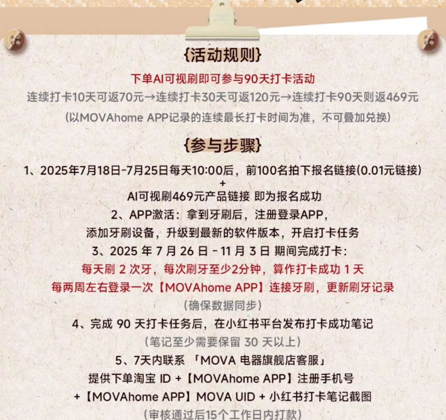
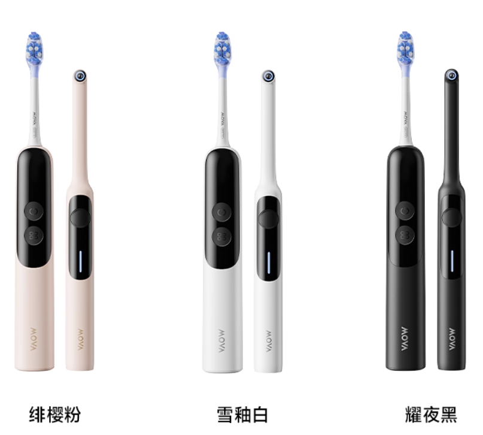
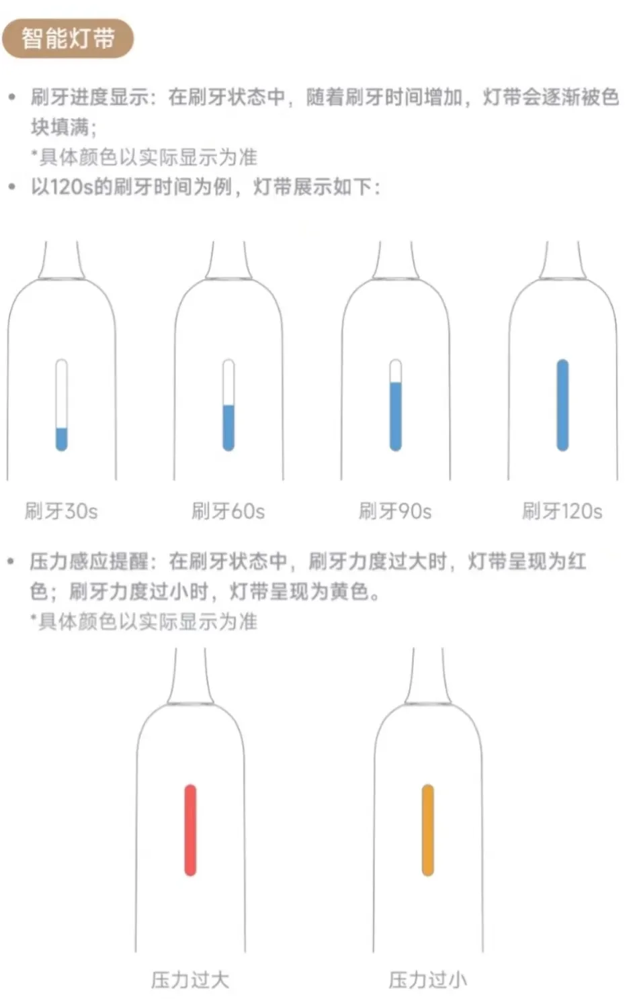
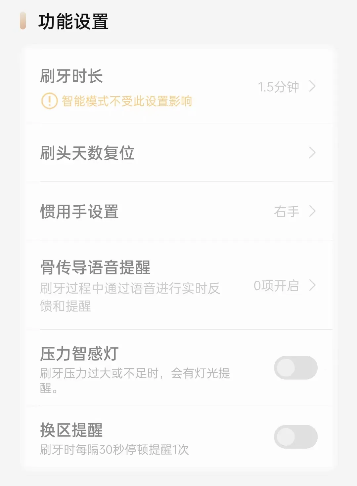

# Mova Fresh20电动牙刷

:(fa-solid fa-calendar-check): 90 天打卡完成🥳
<!--more-->

七月份的一天中午，偶然间刷到一则关于一款电动牙刷的新品尝鲜打卡活动，新品打卡免费的产品之前也有很多类似的营销，又成功地也有失败甚至跑路的。这个套装买的话需要将近小 500，当然价格肯定是虚高的。看了下打卡规则很简单就跟白送一样，每天刷满规定时间次数就算打卡成功一次（后续批次打卡有早晚时间限制），成功 90 次在社交平台发表相关产品内容，毕竟新品推广很正常。后续查询了该公司是追觅的子公司，如果打卡失败与母公司无关，但是考虑资金应该有保证所以还是 [上车]^(参与打卡) 了。  

~以下内容只针对牙刷，牙菌斑检测仪未使用不做说明。~
## 外观

套装内包含电动牙刷一个，可视化牙菌斑检测仪一个，两个牙刷头，一个可粘在墙上放置产品的挂座以及 Type-C 数据线一条。能用 C 口充电器充电非常好评，能够正常充电，无需再找 A 口充电器（之前买的飞科剃须刀虽然是 C 口但是需要 A 口充电器才能充电，[原因点击查看](https://patzer0.com/archives/why-can-not-c-to-c-cable-with-pd-adapater-charge-some-devices)）。

产品一共貌似三个配色：白/黑/粉，考虑黑色下部分一体化更好一点，虽然牙刷头是白色但是整体观感也还可以，所以我购买的是黑色版本，拿到手后的感觉也是如此，对于轻微强迫症的我来说是🆗的。  

牙刷柄前面有块展示信息小屏幕，屏幕展示刷牙的模式，刷到的区域，以及刷牙时间。还有设置等等；后面有一条短灯带，能够展示刷牙进度，从开始慢慢增长到结束。并且针对对牙齿的压力有颜色变化，虽然好像也没多大用处，毕竟有时候是看不到的，当然我说的是从镜子里。  

充电口在底部没有磁吸充电，都这个价格也不上个磁吸确实说不过去，磁吸充电直接站立充电比躺倒充好多了。外部有个防水隔断在充电时可以扣开充电。

## 体验
一共有四种模式，分别为链接检测仪检测互联的**智能模式**、针对第一次使用电动牙刷的**新手模式**、考虑中等压力的**舒缓模式**以及超强清洁力的**亮白模式**。除去智能模式在指定区域压力增大外，其他模式的默认压力值从小到大增加，每种模式的也可以自定义**振动力度**、**扫动角度**和**扫动速度**，满足个人需求。

几年前买过米家 T100，毕竟第一次买电动牙刷，给我的感觉是不好的。一共有两档位，但是每个档位的振动力度对我这个新手来说都挺大的，然后就是刷了几次就回归普通牙刷了🤣。刚开始使用 Mova 牙刷时，特地把所有配置全部调低适应几次后就一直选择舒缓了。

以前使用普通牙刷刷的很快，每个区域刷一下就差不多结束了，这个因为有时间要求每次需要至少达到 2 分钟，但是牙齿被分成了 6 个区域，每个区域我设置刷 30 秒因此每次刷牙的时间就为 3 分钟。这个牙刷有个好处就是每次刷完指定的秒数会短暂停一下，对于切换刷牙区域很有帮助可以避免哪里多刷哪里少刷。3 分钟刷完后整个牙齿做完了一套 SPA，是真的舒服，当然使用含薄荷类牙膏。  
  
这个骨传导提示用户貌似不大，它会在你刷牙时提示哪里需要加强，刷牙结束后如果每个区域都情节完成提示刷牙结束。

Mova Fresh20 根据说明书有 2000mAh 电池，每天两次刷牙的话能够坚持一两个月，当然还是看实际情况而定。充电的话如果有小功率充电器最好，我是手机充电器冲的，至今没有冲坏过。在充电最后 10% 的情况下时间会很长，整个充电时间也很长。

牙刷头提示 3 个月更换一次，原装适配刷头貌似 25/只，不过自带的刷几次就容易炸毛了还是等便宜的第三方适配吧，如果有合适的话推荐一下。

## 打卡

第一批打卡规则及其简单，没有后面几批打卡需要每天在社交平台小红书上发一篇笔记以及早晚时间要求。虽然官方推荐约两周同步一次，不过为了保险起见每次刷完同步一次。通过 :(fa-brands fa-bluetooth): 蓝牙链接，同步数据挺快的花个几秒不碍事。  
  
  
  
  
  
  
📅10-24 打卡完成后第一时间联系客服登记，于昨日📆11-07 晚间淘宝转款结束，审核时间还可以。
## 总结

>[!CAUTION]
>上车有风险，打卡需谨慎！  
>参加此类需要查好资质以及网络风评。

---

> 作者: 吐司气泡  
> URL: https://blog.toastbubble.top/posts/ipn96cn/  

