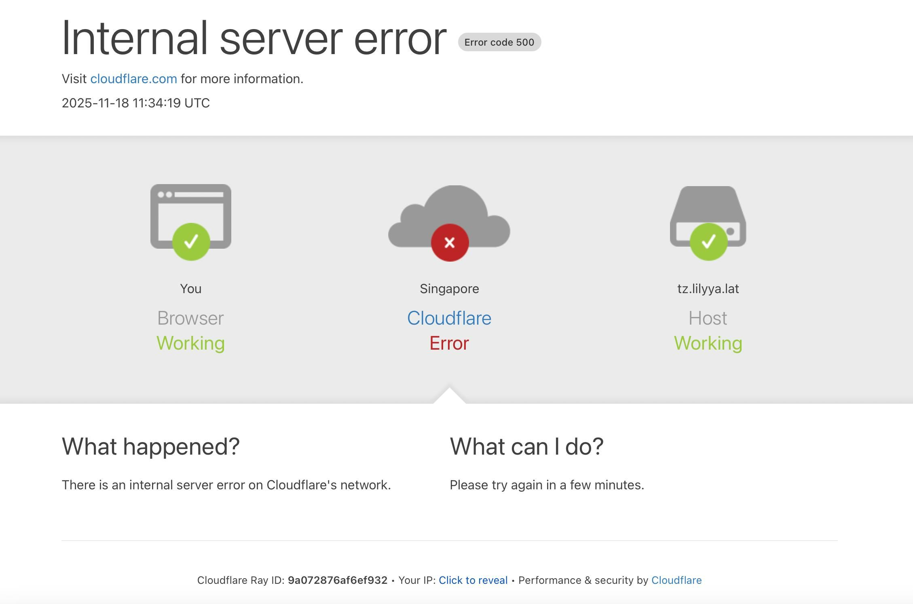

# Cloudflare宕机

<!--more-->

大概是昨天晚上，全球网络基础设施提供商 Cloudflare 出现宕机事件，访问由其管理的任何网页会出现 500error 错误；具有 WAF 保护的网站访问时提示 `请取消阻止 challenges.cloudflare.com后继续`。  

最初访问由其保护的网站时出现提示语，我还以为时 ip 被拉黑或者时因为广告拦截插件的缘故，通过其他设备并关掉广告拦截插件依旧出现该问题，于是去搜索出现的原因，当时并没有考虑到因为 Cloudflare 出现问题，搜索出来的结果也都是毫无关联，后面在搜索 cloudflare 才发现宕机的消息。

可笑的是一些新闻点进去也是 cloudflare 500 错误闭环了属于是🤣，访问网站时恢复过一段时间，然后又 GG 了。宕机事件出现，对于绝大多数网站都出现了不同程度的影响，影响范围非常广。

本站也是托管于 Cloudflare Pages 上，昨天也时出现该问题，所以如果有重要的内容，建议将网站分发到不同的服务商做好备份，以免出现问题。

Cloudflare 官方表示，该问题并非由任何形式的网络攻击或恶意活动直接或间接引起。相反，**它是由 Cloudflare 数据库系统权限的变更触发的**，该变更导致数据库向 Cloudflare 机器人管理系统使用的“功能文件（feature file）”中输出多个条目。该功能文件随后大小翻倍。预期之外的大文件随后被传播到构成网络的全部机器上。[^IT 之家消息]

[^IT 之家消息]: [IT之家：Cloudflare 突发全球故障原因揭秘：官方发文称不是网络攻击](https://baijiahao.baidu.com/s?id=1849178499686364356&wfr=baike)

---

> 作者: bulone  
> URL: https://blog.toastbubble.top/posts/m1lz06m/  

