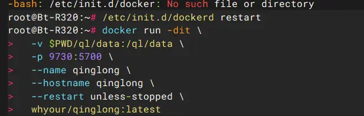
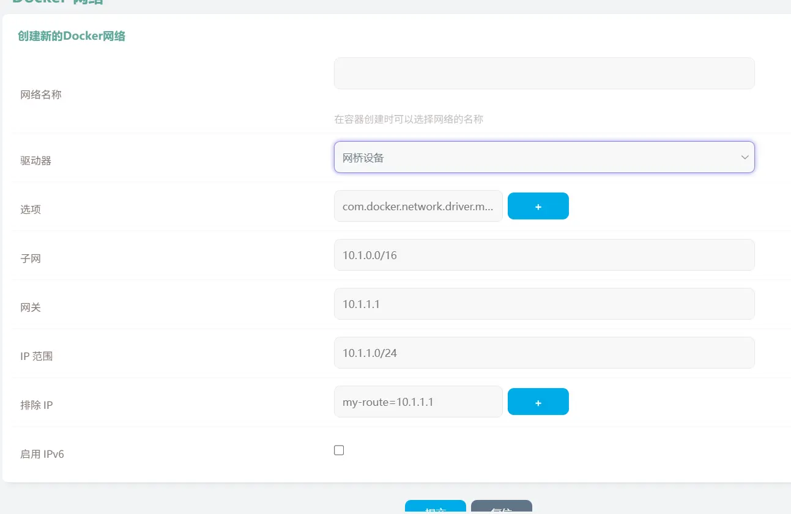
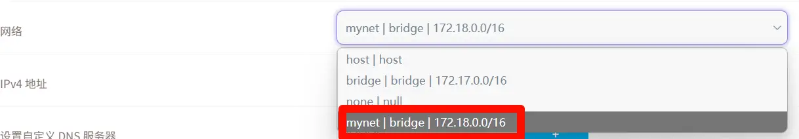
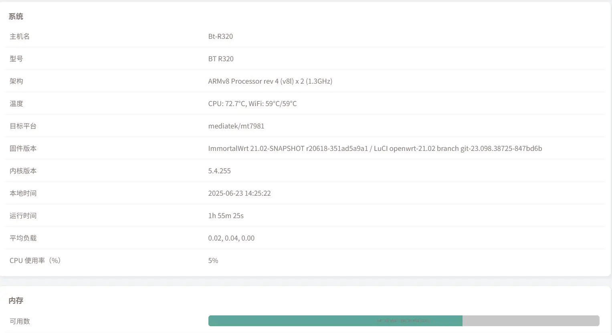

# Bt-R320安装青龙面板


<!--more-->

前几天在闲鱼上淘到一台搭载 Mt7981 型号为 Bt-R320 的 Wifi6 路由器，配置为 1G+128G EMMC+USB3.0 四个千兆网口，大概率是跑 PCDN 淘汰下来的。不过才几十块就能拿到能刷 Immortalwrt 系统的千兆路由还是很香的，并且这配置跑的青龙还是轻轻松松的。

## 刷机
  
具体教程在这个视频中都有，所需文件请到该播主公众号自行下载。

## 配置
刷好系统后，默认访问地址为 192.168.1.1，访问密码为 admin。

在系统 - 挂载点将/mnt/mmcblk0p6 挂载上，然后在 Docker- 配置中将 Docker 根目录改成/mnt/mmcblk0p6，注册表镜像新增 https://docker-0.unsee.tech 点后面➕号。  


在终端中拉取青龙面板。

  
9730 是外部访问接口，可自行修改。对于官网的拉取命令删除了 -e 的两行环境设置，不删我运行访问网站是 Nginx 默认网页，不清楚为何这样，凑活着使用吧。

```bash title="拉取命令"
docker run -dit \
  -v $PWD/ql/data:/ql/data \
  # 冒号后面的 5700 为默认端口，如果设置了 QlPort, 需要跟 QlPort 保持一致
  -p 5700:5700 \
  --name qinglong \
  --network=mynet \
  --hostname qinglong \
  --restart unless-stopped \
  whyour/qinglong:latest
```

注：`--network=mynet` 在下一节说明，为指定自定义的 docker 网络名称，如 docker 默认网络访问没问题请删除该选项！
## 网络
容器使用 bridge 模式访问网络，不清楚为什么无法访问外网，根据搜索来的解决方案，修改后是可以访问的。

1. Docker > 网络 > 新建，填写网络名称，其他不用修改。  
   
2. 新建镜像时，网络选取刚才创建的网络，不要选取默认的 bridge 网络接口。  
   
3. 完成后可在终端设备中进入 docker 容器内对外网进行 ping 操作检测是否可以访问外网。
```bash
docker exec -it 容器名称 /bin/sh
```
4. 如果还是无法访问，在网络 > 防火墙中将转发由拒绝改为接受，保存应用后重启设备。

以上是参考一些链接和询问 Deepseek 给出的解决方案，如果有安全问题或有简单的方法希望能够指出，感谢🙇‍。



## 参考
1. [刷了flippy大神的openwrt固件，容器无法联网-斐讯无线路由器以及其它斐迅网络设备-恩山无线论坛](https://www.right.com.cn/FORUM/thread-4069232-1-1.html)、
2. [132元的路由器新机皇BT-R320 刷机教程\_哔哩哔哩\_bilibili](https://www.bilibili.com/video/BV1zXzEYoEHs/?spm_id_from=333.337.search-card.all.click)
3. [GitHub - whyour/qinglong: 支持 Python3、JavaScript、Shell、Typescript 的定时任务管理平台（Timed task management platform supporting Python3, JavaScript, Shell, Typescript）](https://github.com/whyour/qinglong)

---

> 作者: 吐司气泡  
> URL: https://blog.toastbubble.top/posts/mg7gc5n/  

