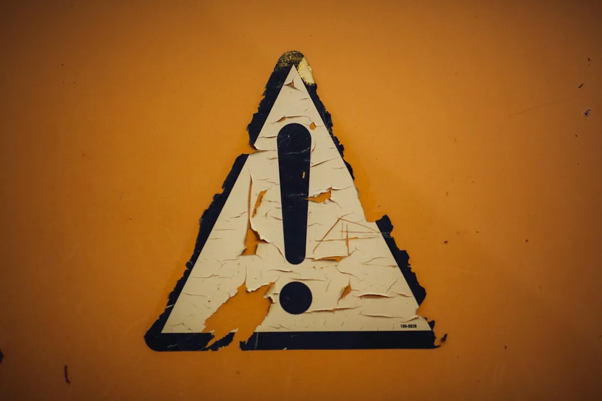

# 增加跳转中间页


<!--more-->
3-29：修改代码，使用主题的链接渲染。  
10-23：修改代码，增加白名单选项。[跳转重新复制粘贴](#链接渲染)  
11-08：修改代码，简洁化跳转页。  
## 引言
之前挺烦一些网站的链接跳转，类如 CSDN，掘金之类的，浪费时间还浪费精力。不过话说回来做中间页跳转还是有必要的，毕竟一些网站域名过期被一些非法网站使用，那么就会导致博客内文章直接引向非法网站，这是万万不可的。所以做中间页提醒访客链接安全未知，在此期间参考了一些博客站文章，感谢博主的分享🙇。  

## 目录文件树
``` {data-open=true}
.
├── assets/
│   ├── css/
│   │   └── _custom.css         # 自定义 CSS 文件
│   └── js/
│       └── _custom.js          # 自定义 JavaScript 文件
│
├── content/
│   └── redirect.md               # Markdown 内容文件
│
└── layouts/
    │   └── redirect.html       # 默认重定向模板
    │
    └── plugin/
        └── link.html           # 插件链接模板
```

## 链接渲染

复制一份主题文件中 `layouts/partials/plugin/link.html ` 的到根目录，并修改成如下。
```html {title="layouts/partials/plugin/link.html"}
{{- $rel := "" -}}
{{- $encoded := "" -}}
{{- $external := false -}}
{{- $noreferrer := true -}}
{{- if eq .Noreferrer false -}}
  {{- $noreferrer = false -}}
{{- end -}}
{{- $url := urls.Parse .Destination -}}
{{- $url := urls.Parse .Destination -}}
{{ $host := lower $url.Host }}
{{ $currentHost := lower (urls.Parse site.BaseURL).Host }}
{{ $trustedDomains := site.Params.whitelist }}
{{ $isTrusted := false }}
{{ $isSameDomain := eq $host $currentHost }}
{{ range $trustedDomains }}
    {{ if hasSuffix $host . }}
        {{ $isTrusted = true }}
    {{ end }}
{{ end }}

{{ $isSameDomain := eq $host $currentHost }}
{{- if $url.IsAbs | or .Newtab -}}
  
  {{- $rel = cond $noreferrer "external nofollow noopener noreferrer" "external nofollow" -}}
  {{- if or $isTrusted $isSameDomain (hasPrefix .Destination "#") }}
    {{- $encoded = .Destination | safeURL -}}
  {{- else}}
    {{- $encoded  = printf "/redirect/?url=%s" (.Destination | base64Encode | safeURL) -}}
  {{- end -}}
  {{- $external = true -}}
{{- end -}}
{{- $class := .Class | default "" -}}
{{- if eq .Card true -}}
  {{- $class = trim (printf "%v %v" "card-link" $class) " " -}}
{{- end -}}
<a href="{{ $encoded | default .Destination | safeURL }}"
  {{- with .Title }} title="{{ . }}"{{- end -}}
  {{- if $external -}} target="_blank"{{- end -}}
  {{- if $rel | or .Rel }} rel="{{ $rel }}{{ with .Rel }} {{ . }}{{ end }}"{{- end -}}
  {{- with $class }} class="{{ with $class }}{{ . }}{{ end }}"{{- end -}}
  {{- with .Download }} download="{{ . }}"{{- end -}}
>
  {{- if ne .Card true -}}
    {{- with .Icon -}}
      {{- partial "plugin/icon.html" . }}
    {{ end -}}
    {{- with .Content -}}
      {{- . | safeHTML -}}
    {{- end -}}
    {{- if 
      (.ExternalIcon | default false) 
      | and $external | and (eq (hasPrefix .Content ``) | or (strings.HasSuffix .Content `):`)) false)
    -}}
      {{- if .Download -}}
        {{- dict "Class" "fa-solid fa-cloud-download-alt fa-fw ms-1 text-secondary" | partial "plugin/icon.html" -}}
      {{- else -}}
        {{- dict "Class" "fa-solid fa-external-link-alt fa-fw fa-xs ms-1 text-secondary" | partial "plugin/icon.html" -}}
      {{- end -}}
    {{- else if .Download }}
      {{- dict "Class" "fa-solid fa-download fa-fw ms-1 text-secondary" | partial "plugin/icon.html" -}}
    {{- end -}}
  {{- else -}}
    {{- $cardIcon := .CardIcon -}}
    {{- if not $cardIcon -}}
      {{- with partial "function/get-remote-image.html" (dict "Src" (add "https://favicon.im/" $url.Host)) -}}
        {{- $cardIcon = .RelPermalink -}}
      {{- end -}}
    {{- end -}}

    {{- $attrs := `class="cl-backdrop"` -}}
    {{- $attrs = printf ` style="--cl-bg-url: url(%v);"` (resources.Get "images/fixit.svg" | minify).RelPermalink | add $attrs -}}
    <span {{ $attrs | safeHTMLAttr }}></span>
    <span class="cl-content">
      <span class="cl-text">
        <span class="cl-title">
          {{- with .Icon -}}
            {{- partial "plugin/icon.html" . }}
          {{ end -}}
          {{- with .Content -}}
            {{- . | safeHTML -}}
          {{- end -}}
        </span>
        <span class="cl-meta">
          <svg class="cl-icon-link" viewBox="0 0 1024 1024" version="1.1" xmlns="http://www.w3.org/2000/svg" width="16" height="16"><path d="M574 665.4c-3.1-3.1-8.2-3.1-11.3 0L446.5 781.6c-53.8 53.8-144.6 59.5-204 0-59.5-59.5-53.8-150.2 0-204l116.2-116.2c3.1-3.1 3.1-8.2 0-11.3l-39.8-39.8c-3.1-3.1-8.2-3.1-11.3 0L191.4 526.5c-84.6 84.6-84.6 221.5 0 306s221.5 84.6 306 0l116.2-116.2c3.1-3.1 3.1-8.2 0-11.3L574 665.4zM832.6 191.4c-84.6-84.6-221.5-84.6-306 0L410.3 307.6c-3.1 3.1-3.1 8.2 0 11.3l39.7 39.7c3.1 3.1 8.2 3.1 11.3 0l116.2-116.2c53.8-53.8 144.6-59.5 204 0 59.5 59.5 53.8 150.2 0 204L665.3 562.6c-3.1 3.1-3.1 8.2 0 11.3l39.8 39.8c3.1 3.1 8.2 3.1 11.3 0l116.2-116.2c84.5-84.6 84.5-221.5 0-306.1z" fill="#a9a9b3"></path><path d="M610.1 372.3c-3.1-3.1-8.2-3.1-11.3 0L372.3 598.7c-3.1 3.1-3.1 8.2 0 11.3l39.6 39.6c3.1 3.1 8.2 3.1 11.3 0l226.4-226.4c3.1-3.1 3.1-8.2 0-11.3l-39.5-39.6z" fill="#a9a9b3"></path></svg>
          <span class="cl-url">
            {{- .Destination | safeURL -}}
          </span>
        </span>
      </span>
      {{- if .Download -}}
        <svg class="cl-shortcut-icon" viewBox="0 0 1024 1024" version="1.1" xmlns="http://www.w3.org/2000/svg" width="64" height="64"><path d="M824.32 473.6c-15.36-2.56-25.6-15.36-25.6-30.72 0-112.64-71.68-217.6-179.2-250.88-148.48-46.08-289.28 38.4-332.8 166.4-2.56 10.24-12.8 17.92-23.04 20.48C143.36 401.92 51.2 509.44 51.2 637.44v2.56c0 115.2 97.28 204.8 209.92 204.8h524.8c102.4-2.56 184.32-84.48 184.32-186.88 2.56-89.6-61.44-163.84-145.92-184.32z m-273.92 225.28c-12.8 12.8-30.72 15.36-46.08 10.24H501.76c-5.12-2.56-10.24-5.12-15.36-10.24L366.08 578.56c-15.36-15.36-15.36-43.52 0-58.88 15.36-15.36 43.52-15.36 58.88 0l51.2 51.2V352.4608c0-23.04 17.92-40.96 40.96-40.96 23.04 0 40.96 17.92 40.96 40.96v218.4192l51.2-51.2c17.92-17.92 43.52-17.92 61.44 0 17.92 15.36 17.92 40.96 0 58.88l-120.32 120.32z" fill="#4FC089"></path></svg>
      {{- else -}}
        {{- with $cardIcon -}}
          {{- if (strings.HasPrefix . "fa") -}}
            <i class="{{ . }} cl-shortcut-icon"></i>
          {{- else -}}
            
          {{- end -}}
        {{- else -}}
          <svg class="cl-shortcut-icon" viewBox="0 0 1024 1024" version="1.1" xmlns="http://www.w3.org/2000/svg" width="64" height="64"><path d="M960 512c0 249.408-203.2 448-448 448-244.778667 0-448-198.592-448-448S262.592 64 512 64s448 198.592 448 448" fill="#2196F3"></path><path d="M507.52 718.08c0-8.96-4.48-13.44-13.44-17.92-26.88-8.96-53.76-8.96-76.16-31.381333-4.48-8.96-4.48-17.92-8.96-26.88-8.96-8.96-31.36-13.44-44.8-17.92h-89.6c-13.44-4.48-22.4-22.4-31.36-35.84 0-4.48 0-13.461333-8.96-13.461334-8.96-4.458667-17.92 4.501333-26.88 0-4.48-4.458667-4.48-8.96-4.48-13.418666 0-13.461333 8.96-26.901333 17.92-35.861334 13.44-8.96 26.88 4.48 40.32 4.48 4.48 0 4.48 0 8.96 4.48 13.44 4.48 17.92 22.4 17.92 35.861334v8.96c0 4.48 4.48 4.48 8.96 4.48 4.48-22.4 4.48-44.821333 8.96-67.2 0-26.88 26.88-53.781333 49.28-62.72 8.96-4.458667 13.44 4.501333 22.4 0 26.88-8.96 94.08-35.84 80.64-71.658667-8.96-31.381333-35.84-62.698667-71.68-58.24-8.96 4.501333-13.44 8.96-22.4 13.461333-13.44 8.96-40.32 35.84-53.76 35.84-22.4-4.48-22.4-35.84-17.92-49.301333 4.48-17.92 44.8-76.138667 71.68-67.178667l17.92 17.92c8.96 4.48 22.4 4.48 35.84 4.48 4.48 0 8.96 0 13.44-4.48 4.48-4.48 4.48-4.48 4.48-8.96 0-13.44-13.44-26.901333-22.4-35.861333s-22.4-17.92-35.84-22.378667c-44.8-13.461333-116.48 4.458667-152.32 35.84-35.84 31.36-62.72 85.12-80.64 129.92-8.96 26.88-17.92 62.698667-22.4 94.08-4.48 22.4-8.96 40.32 4.48 62.698667 13.44 26.88 40.32 53.781333 67.2 71.68 17.92 13.44 53.76 13.44 71.68 35.84 13.44 17.941333 8.96 40.32 8.96 62.72 0 26.88 17.92 49.28 26.88 71.658667 4.48 13.461333 8.96 31.381333 13.44 44.821333 0 4.48 4.48 31.36 4.48 35.84 26.88 13.44 49.28 26.901333 80.64 35.861333 4.48 0 22.4-26.901333 22.4-31.381333 13.44-13.44 22.4-31.36 35.84-40.32 8.96-4.48 17.92-8.96 26.88-17.941333 8.96-8.96 13.44-26.88 17.92-40.32 4.48-8.938667 8.96-26.858667 4.48-40.298667M516.48 305.92c4.48 0 8.96-4.48 17.92-8.96 13.44-8.96 26.901333-22.4 40.32-31.36 13.461333-8.96 26.901333-22.4 35.861333-31.36 13.44-8.96 22.4-26.88 26.88-40.341333 4.48-8.96 17.941333-26.88 13.44-40.32-4.48-8.96-26.88-13.44-35.84-17.92C579.2 126.698667 547.84 122.24 512 122.24c-13.44 0-31.36 4.458667-35.84 17.92-4.48 22.4 13.44 17.92 31.36 22.4 0 0 4.48 35.84 4.48 40.32 4.48 22.421333-8.96 35.84-8.96 58.24 0 13.44 0 35.84 8.96 44.8h4.48zM892.8 619.52c4.501333-8.96 4.501333-22.4 8.96-31.36 4.501333-22.421333 4.501333-44.8 4.501333-67.2 0-44.8-4.501333-89.578667-17.92-129.92-8.96-13.44-13.461333-26.88-17.941333-40.341333-8.96-22.378667-22.4-44.8-40.32-62.698667-17.92-22.4-40.341333-85.12-80.64-67.2-13.44 4.501333-22.4 22.421333-31.36 31.381333l-26.88 40.32c-4.501333 4.48-8.96 13.44-4.501333 17.92 0 4.48 4.501333 4.48 8.96 4.48 8.96 4.501333 13.461333 4.501333 22.421333 8.96 4.48 0 8.96 4.501333 4.48 8.96 0 0 0 4.501333-4.48 4.501334-22.421333 22.4-44.8 40.32-67.2 62.698666-4.48 4.48-8.96 13.44-8.96 17.92s4.48 4.48 4.48 8.96c0 4.501333-4.48 4.501333-8.96 8.96-8.96 4.501333-17.92 8.96-22.4 13.461334-4.48 8.96 0 22.4-4.48 31.36-4.48 22.4-17.941333 40.32-26.901333 62.72-8.96 13.418667-13.418667 26.88-22.378667 40.32 0 17.92-4.501333 31.36 4.458667 44.8 22.421333 31.36 62.72 13.44 94.08 26.901333 8.96 4.458667 17.92 4.458667 22.421333 13.418667 13.418667 13.461333 13.418667 35.861333 17.92 49.301333 4.458667 17.92 8.96 35.84 17.92 53.76 4.48 22.421333 13.44 44.821333 17.92 62.72 40.341333-31.36 76.16-67.178667 103.04-112 26.88-31.424 40.341333-67.242667 53.76-103.104" fill="#CDDC39"></path></svg>
        {{- end -}}
      {{- end -}}
    </span>
  {{- end -}}
</a>
{{- /* EOF */ -}}
```
在配置文档 `hugo.toml` 中的 params 下新增加名为 `whitelist` 数组，**开头空两格而非 tab**，与下面格式一致即可。每个链接只需要主域名，英文逗号隔开，默认通配符适配。  

## 跳转页网页
在 `layouts/_default/` 中创建 `redirect.html` 文件，复制下面代码。  
<sub>注：仅适用于 Fixit 主题，其他主题自行测试。</sub>
```html
<!DOCTYPE html>
<html itemscope itemtype="http://schema.org/WebPage" lang="{{ .Site.LanguageCode }}">

<head>
    <meta charset="utf-8">
    <meta name="viewport" content="width=device-width, initial-scale=1, maximum-scale=2">
    <meta name="robots" content="noodp" />
    <title>{{ .Title }} - {{ .Site.Title }}</title>
    <meta name="robots" content="noindex, nofollow">
    <meta name="referrer" content="no-referrer">
    <meta charset="utf-8">
    <meta name="viewport" content="width=device-width, initial-scale=1">
    {{- partial "head/link.html" . -}}
</head>

<body>
    {{- /* Body wrapper */ -}}
    <div class="wrapper" data-page-style="{{ (partial `function/params.html`).pageStyle | default `normal` }}">
        <main class="fi-container" style="align-items: center;">
            <div class="external-warning" data-aos="zoom-out-up">
                <div class="logo-title-container">
                    
                    <span class="warning-title">即将离开{{ .Site.Title }}</span>
                </div>
                <p>您访问的网站可能包含未知的安全风险，请注意您的帐号和财产安全。</p>
                <div class="external-url" id="target-url">{{ .Params.url }}</div>
                <div class="button-group">
                    <a class="button continue-btn" id="proceed-link">继续前往</a>
                </div>
            </div>
        </main>
    </div>

    <script>
        // 解码URL并显示
        const params = new URLSearchParams(window.location.search);
        const encodedUrl = params.get("url");
        const decodedUrl = atob(encodedUrl);
        document.getElementById('target-url').textContent = decodedUrl;
        document.getElementById('proceed-link').href = decodedUrl;
    </script>
    {{- partial "assets.html" . -}}
</body>

</html>
```

## 页面文件
在 content 中创建 `redirect.md`。
```yaml
---
title: 风险跳转提示
layout: "redirect"
type: "redirect"
---
```
title 指的是跳转页网站 Title，layout 指的是使用 redirect 模板。

## CSS 样式文件
在 `_custom.scss` 中粘贴下述样式。
```scss
/* -------------------- 跳转页 ------------------- */
.external-warning {
    max-width: 700px;
    margin: 3rem auto;
    padding: 2rem;
    border: 1px solid #eee;
    border-radius: 1rem;
    box-shadow: 0 2px 12px rgba(0,0,0,0.1);
    line-height: 1.6;
    text-align: center;
}
.warning-title {
    color: #d32f2f;
    margin-top: 0;
}
.external-url {
    word-break: break-all;
    background: #f5f5f5;
    [data-theme="dark"] & {
	    background: #363636
    }
    padding: 0.5rem;
    border-radius: 1rem;
    display: inline-block;
    max-width: 100%;
    overflow: hidden;
    text-overflow: ellipsis;
}
.button-group {
    margin-top: 1.5rem;
    display: flex;
    gap: 1rem;
    flex-wrap: wrap;
    justify-content: center;
}
.button {
    padding: 0.75rem 1.5rem;
    border-radius: 1rem;
    text-decoration: none;
    font-weight: 500;
    transition: all 0.2s;
}
.continue-btn {
    background: #8B4513;
    color: white;
}
.continue-btn:hover {
    background: #D2A679;
    [data-theme="dark"] & {
        color: #8B4513;
    }
}
```

## JS 文件
上述只是包含了文章页 content 部分的链接，在 `custom.js` 复制下述代码，把特殊样式以及 Waline 评论的 a 链接属性都包含。代码来自 [@空白Koobai](https://koobai.com/zhongjiantiaozhuan/)
```js {title="assets/js/_custom.js"}
/* ------------------ 跳转风险提示 ------------------ */
document.body.addEventListener('click', function (e) {
  const target = e.target.closest('.wl-cards a, .card-link, .device-link');
  if (!target) return;
  const href = target.getAttribute('href');
  if (!href) return;

  // 排除本地链接
  const isLocalLink =
    href.startsWith('#') ||
    href.startsWith('javascript:') ||
    href.startsWith('mailto:') ||
    href.startsWith('tel:') ||
    href.startsWith('/') ||
    !href.includes('://');
  if (isLocalLink) return;

  const url = new URL(target.href, window.location.href);
  const currentDomain = window.location.hostname;

  // 域名白名单（直接放行的外部域名）
  const whitelistDomains = [
    'bulone.github.io',
    'blog.toastbubble.top'
  ];

  // 检查是否在白名单中
  const isWhitelisted = whitelistDomains.some(domain =>
    url.hostname === domain || url.hostname.endsWith(`.${domain}`)
  );

  // 排除当前域名及其子域名
  const isCurrentOrSubDomain =
    url.hostname === currentDomain ||
    url.hostname.endsWith(`.${currentDomain}`);

  // 条件判断优先级：
  // 1. 白名单域名 -> 直接放行（不拦截）
  // 2. 当前域名/子域名或排除路径 -> 不处理
  // 3. 其他外部链接 -> 重定向
  if (isWhitelisted) {
    return; // 允许白名单域名正常跳转
  } else if (isCurrentOrSubDomain) {
    return; // 不处理当前域名或排除路径
  } else {
    e.preventDefault();
    const encodedUrl = btoa(target.href);
    window.open(`/redirect?url=${encodedUrl}`, '_blank');
  }
});
```

## ~~缺点~~
~~文章内的链接没有做白名单处理，只是博客站才没进行链接加密操作。~~

## 参考链接
1. [HUGO 外链跳转到中间页 - 空白Koobai](https://koobai.com/zhongjiantiaozhuan/)
2. [Hugo外部链接跳转提示页面](https://www.eallion.com/hugo-redirect-landing-page/)
3. [博客外链跳转到中间页 \| Solitudes](https://blog.ysicing.net/site-jump-external-link)
4. [DeepSeek \| 深度求索](https://www.deepseek.com)

---

> 作者: bulone  
> URL: https://blog.toastbubble.top/posts/nyzk0nu/  

