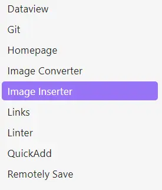
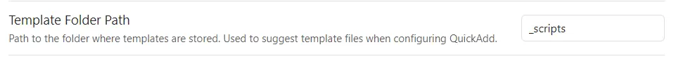
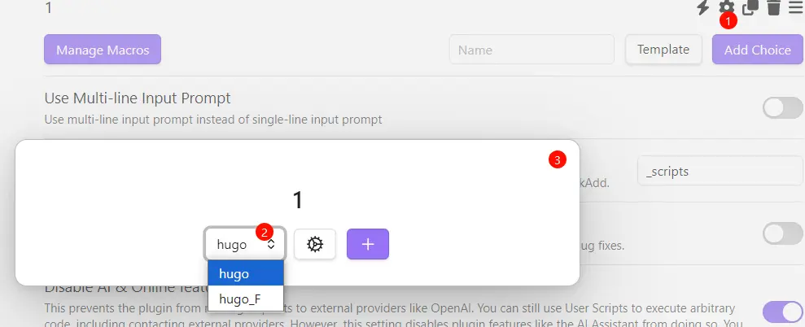

# 博客建站记录


<!--more-->

虽然文笔不好，但是看见一个属于自己的站点就很开心。之后尝试过很多博客系统，耳熟能详的 Wordpress,Typecho 还有 Emblog 等。文章没写几篇系统倒是换了不少。而且每次更换都不进行文章备份，所以每次都是全新的博客站。有点跑题了，这些系统无一例外都要购买服务器或虚拟空间，对于当时还是学生的我只能寻找几块一月随时跑路的虚拟空间安装。所以上面说这么多，有钱就尝试动态博客系统，在线随时编写发布。静态博客就需要有台电脑方便些。

静态博客也有很多不过还是选择了 Hugo，因为从 `建立`->`编写`->`发布` 所需要的代码量相对很少，而且不接触 npm 那些。

## 安装 Hugo

所需工具：Hugo，Git  
Git 无需多言，之间下载安装即可。  
[Hugo官网](https://gohugo.io/installation/)Windows 提供三种三种通过包管理器进行安装，之后选择按照教程安装即可。

## 选择主题
选择合适的主题进行安装，每个主题都有详细的安装教程，根据教程进行安装。

## 选择编写工具

因为 Hugo 的文章都是 Markdown 类型，所以选择 Markdown 编写软件体验会更好。选择 Obsidian 的原因是可提供的插件多而且免费。在里面就可以一套流程走完，不需要再开命令行之类的。

### 使用的插件


1. DataView：创建代码块查询文章数据。
2. HomePage：搭配 DataView 可以轻松的创建文章回顾。
3. Git：在 Obsidian 中进行 git 相关操作。
4. Image Converter：压缩转换图片用。
5. Linter： 格式化文档，保存时插入最后更新时间等。
6. QuickAdd：编写 js 代码在 Obsidian 中就可以新建文章。  
其他的插件自行搜索查询相关功能。

QuickAdd 新增文章代码 (由 Deepseek 生成)：
```javascript
// 使用QuickAdd插件的scripting功能
module.exports = async (params) => {
    // 获取文件夹名称
    const folderName = await params.quickAddApi.inputPrompt("请输入文件夹名称");
    if (!folderName) {
        new Notice("未输入文件夹名称。操作已取消。");
        return;
    }

    const basePath = '/content/posts';
    const folderPath = `${basePath}/${folderName}`;
    const filePath = `${folderPath}/index.md`;

    try {
        // 创建文件夹（如果不存在）
        if (!await params.app.vault.adapter.exists(folderPath)) {
            await params.app.vault.createFolder(folderPath);
        }
    } catch (err) {
        new Notice("创建文件夹失败：" + err.message);
        return;
    }

    // 获取当前日期
    const currentDate = window.moment().format("YYYY-MM-DDTHH:mm:ss+08:00");

    // 生成唯一ID
    const uniqueID = Math.random().toString(36).substring(2, 9);

    // 创建文件内容需要的Frontmatter自行添删
    const fileContent = `---
title: ${folderName.replace(/-/g, " ").replace(/\b\w/g, l => l.toUpperCase())}
date: ${currentDate}
slug: ${uniqueID}
description:
draft: true
tags:
  - draft
categories:
  - draft
featuredImage: 
featuredImagePreview: 
---

<!--more-->`;

    try {
        // 创建文件并获取文件引用
        const newFile = await params.app.vault.create(filePath, fileContent);
        new Notice(`已在 ${folderName} 文件夹中创建 index.md`);
        
        // 获取当前活动的叶子（标签页）或在新的叶子中打开文件
        let leaf = params.app.workspace.getLeaf();
        
        // 打开新创建的文件
        await leaf.openFile(newFile);
        
        // 可选：将焦点移动到编辑器
        params.app.workspace.setActiveLeaf(leaf, { focus: true });
        
    } catch (err) {
        new Notice("创建文件失败：" + err.message);
    }
};
```
*该代码在 posts 生成 `文件夹/index.md` 效果*  
使用方法：
1. 复制并新建 js 文件在 Hugo 文件夹内，如 _scripts/newpost.js；
2. 在 QuickAdd 插件配置中的 `Template Folder Path` 中将文件夹名称填入；  
   
3. 点击 `Mange Macros` 按钮，在新弹窗底部输入框内输入名称后点击 `Add macro`；
4. 新建完成后点击 `Config`->Use Scripts 选择刚才创建的 js 文件 ->点击 `ADD`；
5. 返回到插件主选项，将 Template 点击选择 Macro 然后输入 Name 后 Add Choice；  
   
6. 点击⚙，选择刚才新增的 Macro 名称然后叉掉即可；  
   
7. `Ctrl+P` 输入 QuickAdd 刚才新建的 Choice 名称即可，也可以新增快捷键快速添加。

## 发布
编写完成保存后直接推送到远程 Hugo 源码仓库，仓库接收到更新后自动使用 Github Action 生成网站内容推送到 Github Page 仓库，直接一步到位更新网站。

Github Action 代码：来自 [KrislinBlog](https://krislinzhao.github.io/docs/create-a-wesite-using-github-pages-and-hugo)
```yml
name: github pages # 名字自取

on:
  push:
    branches:
      - main  # 这里的意思是当 main分支发生push的时候，运行下面的jobs，这里先改为github-actions

jobs:
  deploy: # 任务名自取
    runs-on: ubuntu-latest	# 在什么环境运行任务
    steps:
      - uses: actions/checkout@v2	# 引用actions/checkout这个action，与所在的github仓库同名
        with:
          submodules: true  # Fetch Hugo themes (true OR recursive) 获取submodule主题
          fetch-depth: 0    # Fetch all history for .GitInfo and .Lastmod

      - name: Setup Hugo	# 步骤名自取
        uses: peaceiris/actions-hugo@v2	# hugo官方提供的action，用于在任务环境中获取hugo
        with:
          hugo-version: 'latest'	# 获取最新版本的hugo
          extended: true

      - name: Build
        run: hugo --minify	# 使用hugo构建静态网页

      - name: Deploy
        uses: peaceiris/actions-gh-pages@v3	# 一个自动发布github pages的action
        with:
          # github_token: ${{ secrets.GITHUB_TOKEN }} 该项适用于发布到源码相同repo的情况，不能用于发布到其他repo
          external_repository: bulone/bulone.github.io	# 发布到哪个repo
          personal_token: ${{ secrets.ACTION_ACCESS_TOKEN }}	# 发布到其他repo需要提供上面生成的personal access token
          publish_dir: ./public	# 注意这里指的是要发布哪个文件夹的内容，而不是指发布到目的仓库的什么位置，因为hugo默认生成静态网页到public文件夹，所以这里发布public文件夹里的内容
          publish_branch: main	# 发布到哪个branch

```

---

> 作者: 吐司气泡  
> URL: https://blog.toastbubble.top/posts/pougfvs/  

