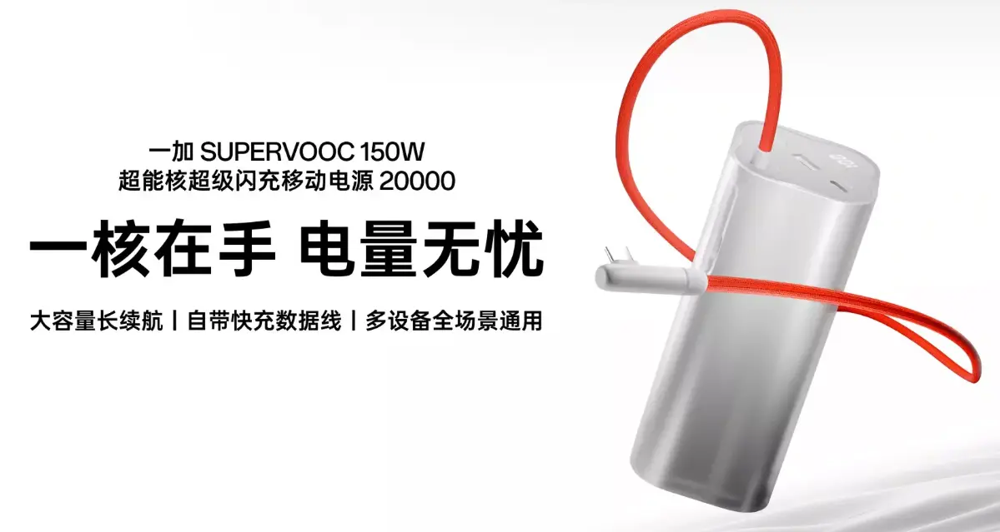
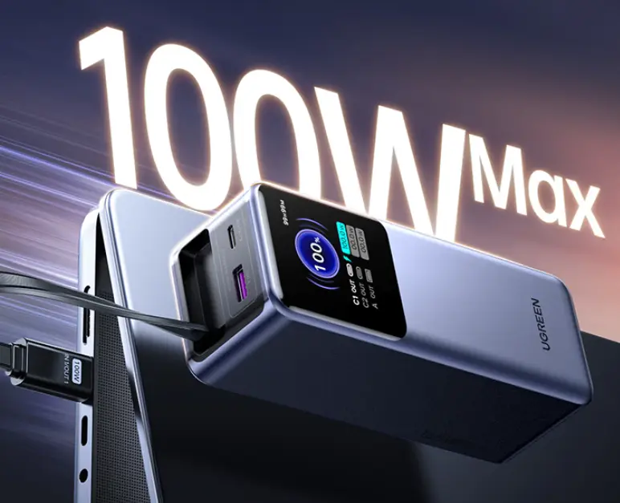
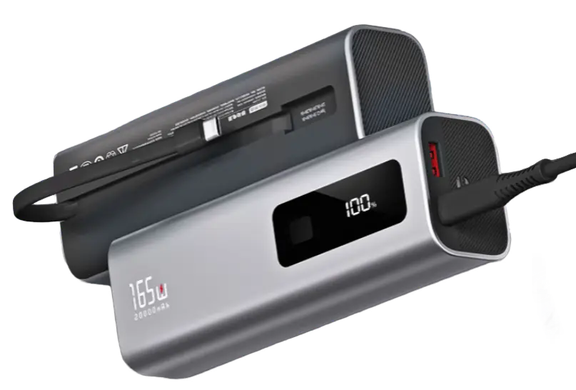
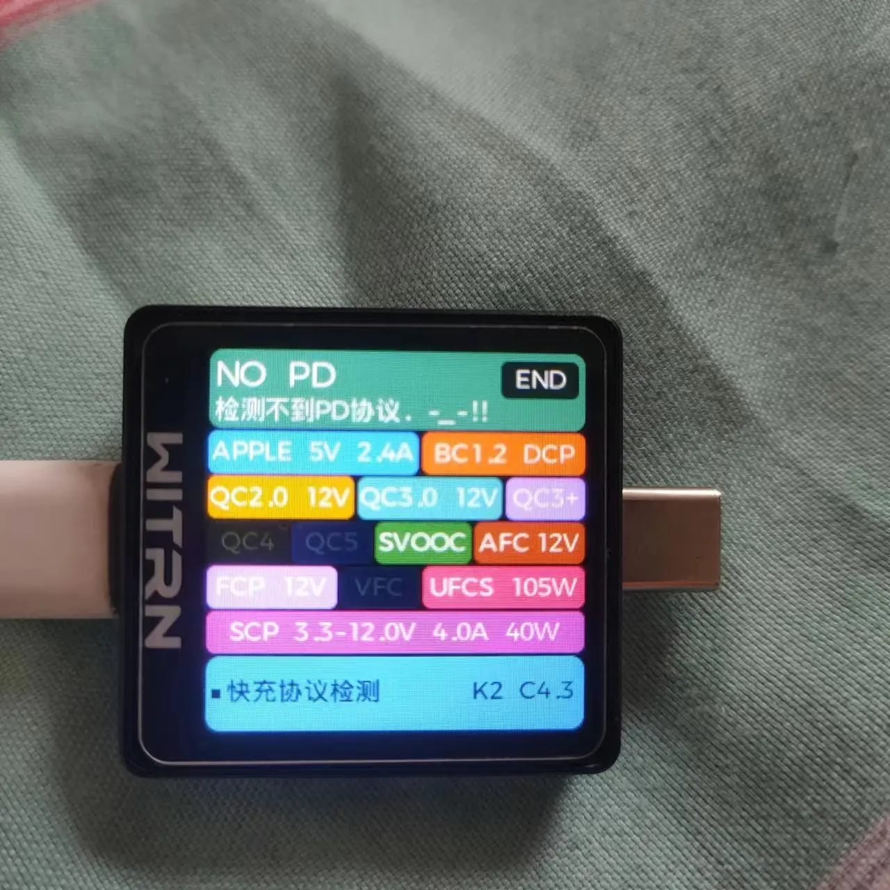
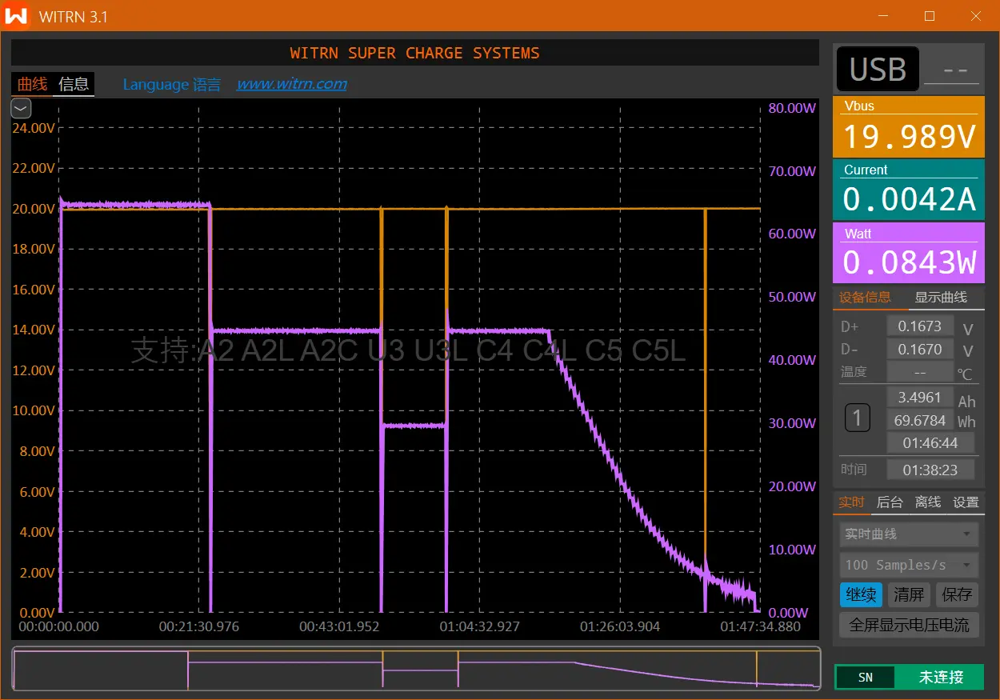
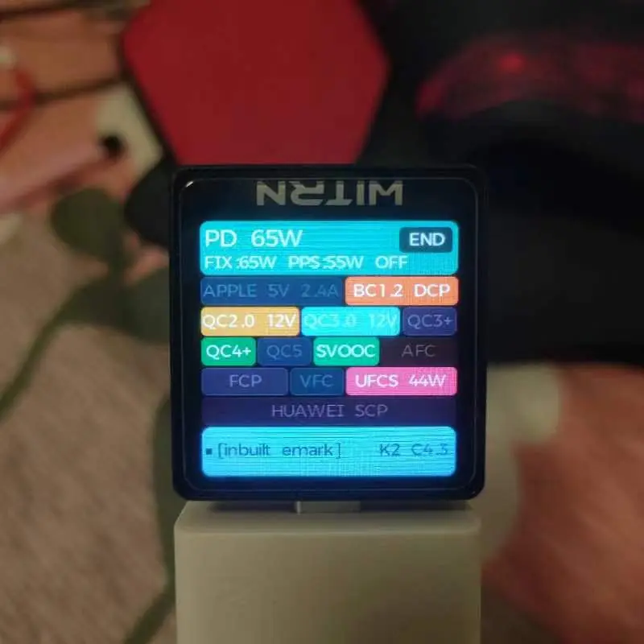

# 补电搭子

<!--more-->
## 充电宝
### 前言

 前几个月罗马仕充电宝事件，加速了充电宝行业的正规化、安全化发展，并且强制执行 3C 标准。对于 19 年淘宝买的迈珀充电宝，终于找到理由也可以下岗了，经过了几个月的时间充电宝的价格相对于稳定了许多，可以下手选择了。

因为是绿厂老款手机，当时对于公有协议的支持十分有限，最大也就 PD/QC18W 速率充电。首先考虑过绿厂自家出品的充电宝，20000mAh 仅有一款，其他部分为 10000mAh 左右，而且其充电宝在网上风评确实褒贬不一，部分款还出现过断冲现象，所以首先 pass。

自家的首先排除后，目标就转向第三方。当时想着后续新款手机可能会支持 UFCS/PPS，所以买一个不带有私有协议的大功率充电宝，老款手机使用协议线就行，因此就买了绿联 165w 充电宝。其屏幕设定还有伸缩线确实非常喜欢，而且采用的长虹三杰电池也有一定的保障。拿到手后发现其体积和重量确实是一个无法忽视的点，整个外型是属于矮胖的类型，拿在手里很粗，有收纳包没挂绳，携带的话可能会有点麻烦。后续还是接受不了因此转卖给了需要的人，协议线当时也没购买，因为总感觉第三方破解的协议后续会出现问题，而且这种协议线的厂家并非大厂所以品质和品控也难以把握。  

接着就刷到了京东京造的这款 165W 充电宝，受委托生产为深圳乔威，一家专注代工的公司。  

### 介绍

锂电池能量：20000mAh 72Wh  
额定能量：11000mAh (5V 3A)  
外围大小：159\*53\*43.88mm  
重量：460g 左右  
输出功率：最大 100W  
输入功率：PD 65W

外观就是普通的柱状，没有大屏幕只是一个简单的电量屏。商品详情说明的协议与实际测得的协议有出入，反向虚标还是其他原因不得而知，以下是测得各口协议。

  
{}

|  |  |
| ------------------------------------------------- | --------------------------------------------------------- |

{}  
{}

|  |  |
| ------------------------------------------------- | --------------------------------------------------------- |

{}  
{}  
  
{}  


三个口支持的协议数量功率还是可以的，虽然有 SuperVooc，不过测试的时候最大电流貌似不超过 5A，自带线和绿厂原装线均如此。三口均有 UFCS 协议和 SCP,因此荣耀系充电首先识别低功率 SCP 而非大功率 PPS 协议。我手上这个充电宝自充时间大约在 1 小时 45 分钟左右，整体时间略长不过处于合理范围之内，自充功率会受到温度影响因此时间可能会有变化。

|  |  |  |
| --------------------------------------------------------- | --------------------------------------------------------- | -------------------------------------------------------- |

以上是利用维简 K2 对充电宝自充时功率检测，充电宝的最后涓流时间过长，充电宝在进行多次充放电后电量统计会相对较准确，在 UI 显示 100% 后可能涓流还会再冲 10 分钟左右。

## 充电头

绿厂在今年出品了一款新的充电头，整体小巧支持针脚折叠，并且支持大功率私有协议，对共有协议的支持也很友好。再过了几个月的时间，整体价格也下降到合适的价位。10 月份要出联名套装，PD 功率也来到 100W 了，不过价格相对于普通版加了几十块不是太合适。

|  |  |  
| ------------------------------------------------- | --------------------------------------------------------- |  

正如其名字一般，充电头的体积相对于手机原装大体积充电头而言，变得更加格式携带。而且支持公有协议，对于其他设备来说也可以少带一个充电头。单口情况下并没有多大的缺点，毕竟这么小的氮化镓充电头多口情况下发热情况、功率就难以保障了。

充电头套装赠送的一根 1m 磁力数据线，方便收纳。就是整体外观估计时间长了出现发黄的迹象，而且拿到手之后发现出现了锈点。

以上充电宝充电头对于短时补电挺合适的，建议充电宝购买两年全保换新，毕竟那根数据线的位置很尴尬，外皮扁平状容易断开（在评论区看到几个了）。

---

> 作者: 吐司气泡  
> URL: https://blog.toastbubble.top/posts/sa6va10/  

