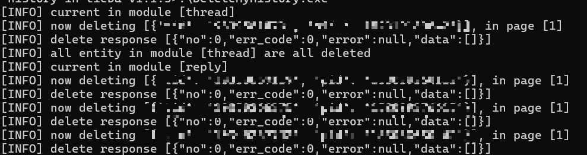

# 贴吧历史内容删除

<!--more-->
## 前情
贴吧没有对应的注销功能，或者说百度系应用因为共用一个账号体系则会导致注销一点全面注销。又因为一点点找历史自己的弱智发言有很费劲，于是乎在 Github 上找到了此款工具协助删除历史内容做到伪注销。
## 使用方法
1. 设备上 Python 版本＞3。
2. 在 Release 页面将文件下载解压。
3. 将 https://tieba.baidu.com 页面内 cookie 复制粘贴至 cookie.txt 文件内。
4. 双击 DeleteMyHistory.exe 或者通过命令行 `.\DeleteMyHistory.exe` 启动程序。（如果双击出现闪退现象，那么需要表明 cookie 失效，可以借助插件复制完整 cookie）
5. 因为贴吧系统有风控程序，每天删除有上限，如果内容过多建议分天操作。

config.toml 字段内容，enable 是启用该部分，start_page 是开始页面参数，没有问题一般无需更改。

| thread | reply | followed_ba | concern | fans |
| :----: | :---: | :---------: | :-----: | :--: |
|  主题帖   |  回复   |    关注的吧     |   关注    |  粉丝  |

程序在 Github 上属于开源项目，如果还是不放心可以在操作完成后修改密码等操作使得 cookie 失效即可。

## 参考链接
1. [GitHub - rmb122/delete-my-history-in-tieba: 删除在百度贴吧的回复、主题帖、关注等](https://github.com/rmb122/delete-my-history-in-tieba)
2. [Cookie-Editor - Microsoft Edge Addons](https://microsoftedge.microsoft.com/addons/detail/cookieeditor/neaplmfkghagebokkhpjpoebhdledlfi)

---

> 作者: bulone  
> URL: https://blog.toastbubble.top/posts/tmz2wgw/  

