# 京东京造能量怪兽15号充电宝

<!--more-->

拿到手也使用了几天时间，毕竟只有使用过后才有发言权嘛。充电宝整体来说还是符合我的胃口的，无论是功率大小还是协议支持情况，整体约 450g 的重量在同档位容量中也不算很重的一档。下面就对这款充电宝进行大致的情况说明。

## 信息

**代工厂**：深圳乔威电源有限公司  
**电池能量**：20000mAh  
**额定能量**：11000mAh (5V 3A)  
**最大输出**：100W  
**最大输入**：65W  
**电芯**：长虹三杰 21700
## 外观

外观采用灰色加黑色搭配，前置有电量显示屏和按钮，短按亮屏，双击断电关闭屏幕，长按进入小电流模式，屏幕呈现跑马灯现象。因为是灰色外观所以有一定的科技感，参数信息置于充电宝背面，因为没有做一定的保护措施，可能会出现因为摩擦导致文字褪色，不易观察。

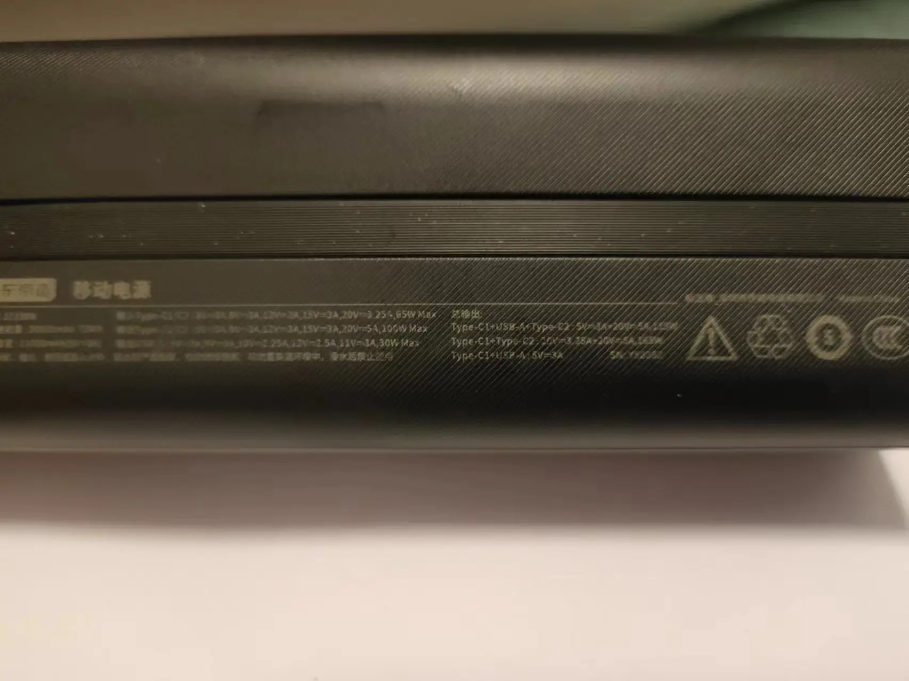

背面进行条纹处理增加整个充电宝的防滑效果，一根扁平黑色支持 100W 输入输出自带线就藏在背面内，头部没有磁吸效果，仅仅是通过线卡在凹槽中保证固定效果。线的材质根据商家描述为 TPU，耐破裂，不过根据评论区反馈，还是存在破裂现象，因此如要购买此款建议搭配两年全包换新服务。整体大小为 159\*53\*41.5mm，顶部带有编织挂绳，无论是用手提着还是握在手里都还可以，当然这么重还是在包里舒服些。

| 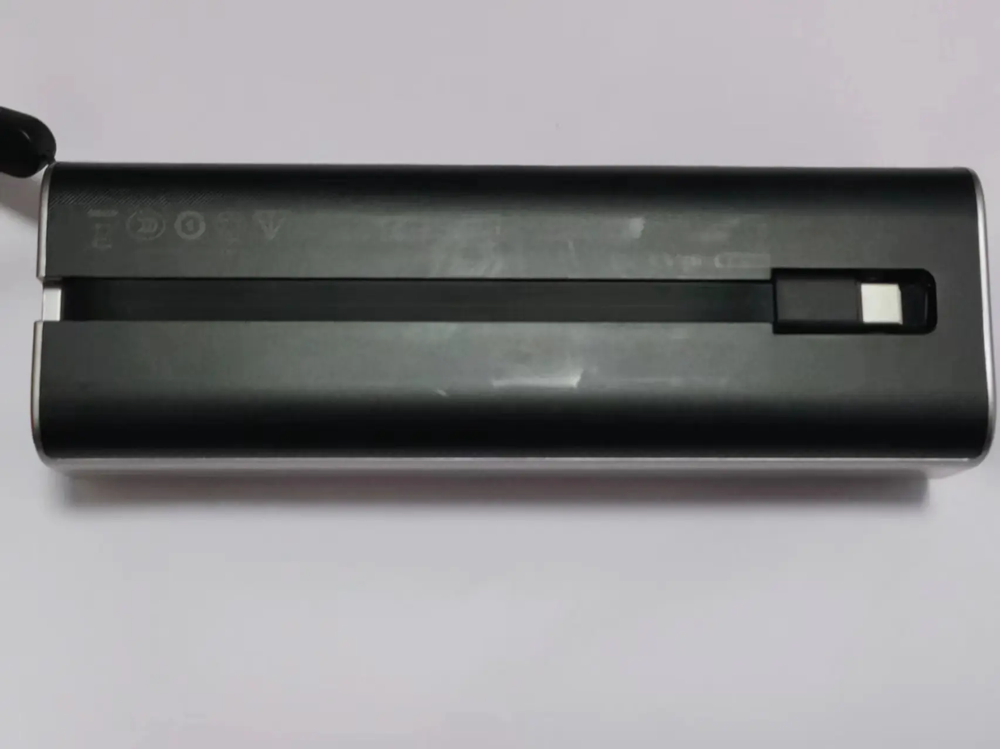 | 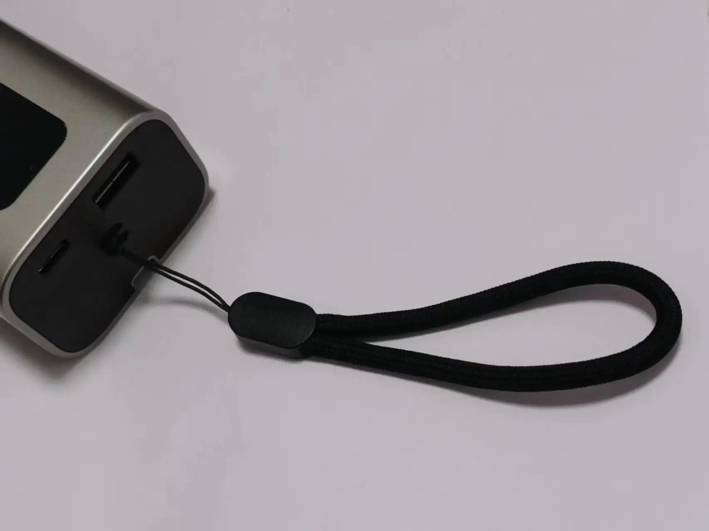 |
| ------------------------------------------------------- | ------------------------------------------------- |

## 性能

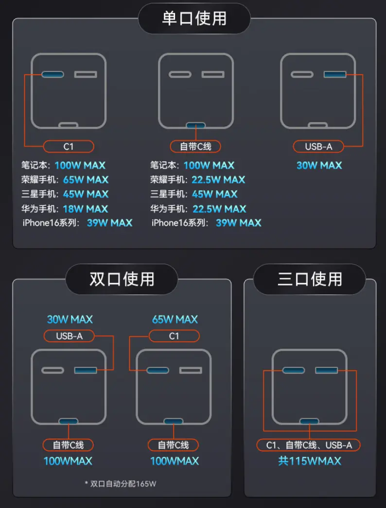

通过功率表协议检测，三个口的协议支持情况与商品详情图中出现不一致情况，反向虚标还是其他原因不得而知，以下是协议检测情况。

  
{}

| 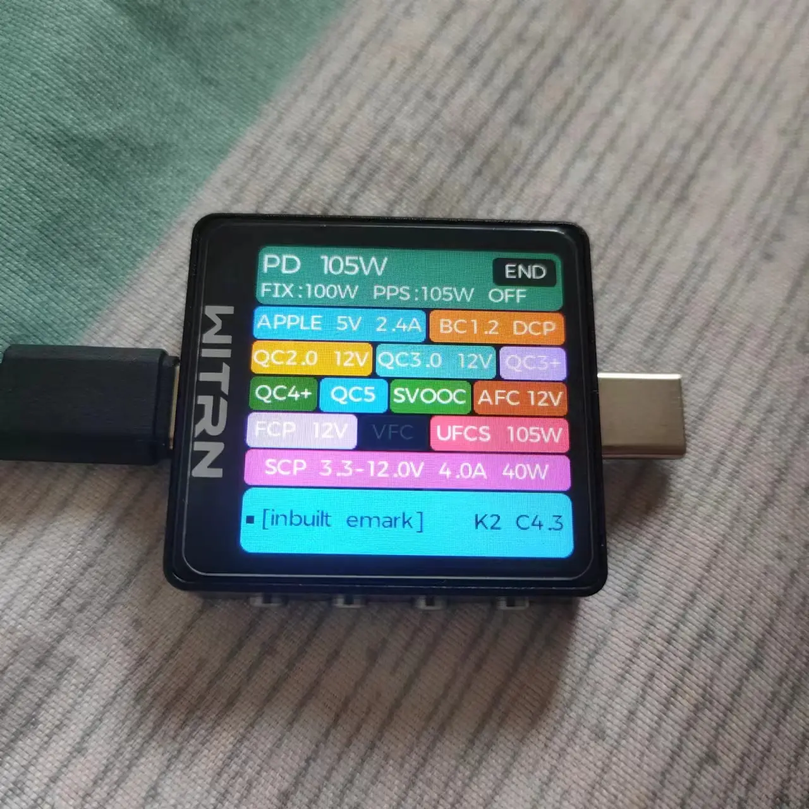 | 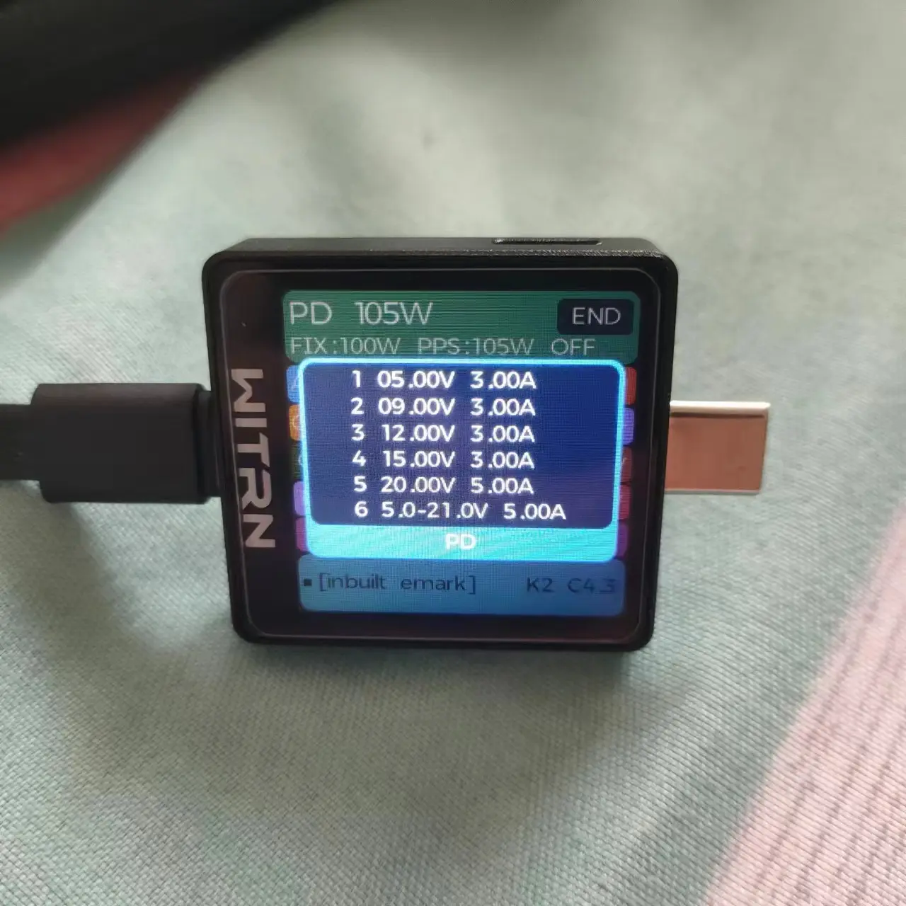 |
| ------------------------------------------------- | ------------------------------------------------- |

{}  
{}

| 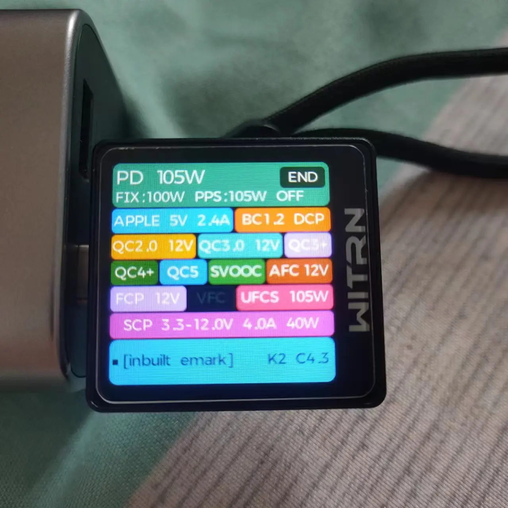 | 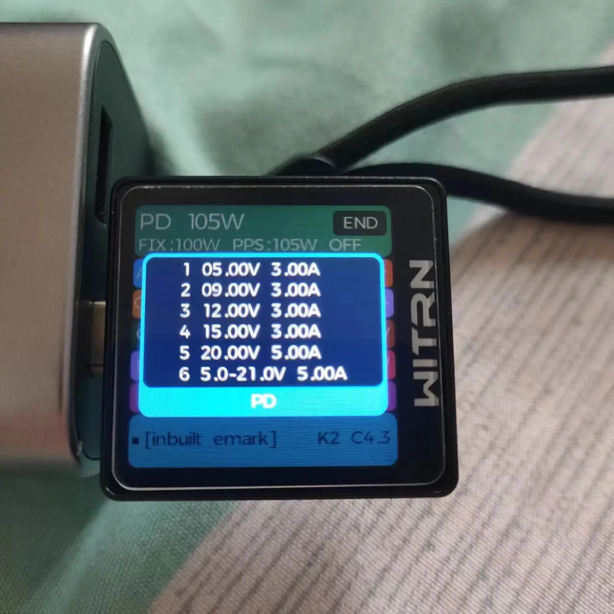 |
| ----------------------------------------------- | ----------------------------------------------- |

{}  
{}  
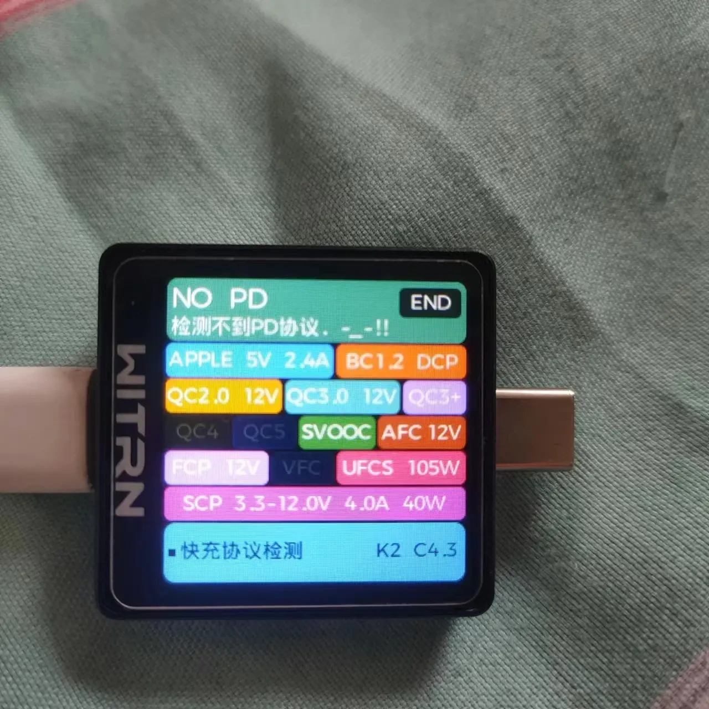  
{}  


因为没有相应设备，所以对于 A 口的 105W UFCS 存疑。通过协议检测此款充电宝支持的协议相对较多，针对华为系和 OPPO 系都有对应的私有协议支持，但是对于小米系和 VIVO 系私有协议支持较差。因为 SCP 和 PPS 在同一接口所以荣耀系列会首先握手 SCP 协议而非 PPS 协议。对于同时支持 UFCS/PPS 协议的手机，会首先握手 UFCS 协议，因此根据个人需求进行购买。

因为是输入功率为 65W，而且涓流时间过长，进一步导致充满时间大幅增加。通过多次充电测试，从 UI 0%-100% 至充满低功率输入，时间约为 1 小时 35 分钟 -1 小时 40 分钟左右，平均功率约为 40W 左右，充电功率受温度影响，不存在某些品牌定时器效应。

|  | 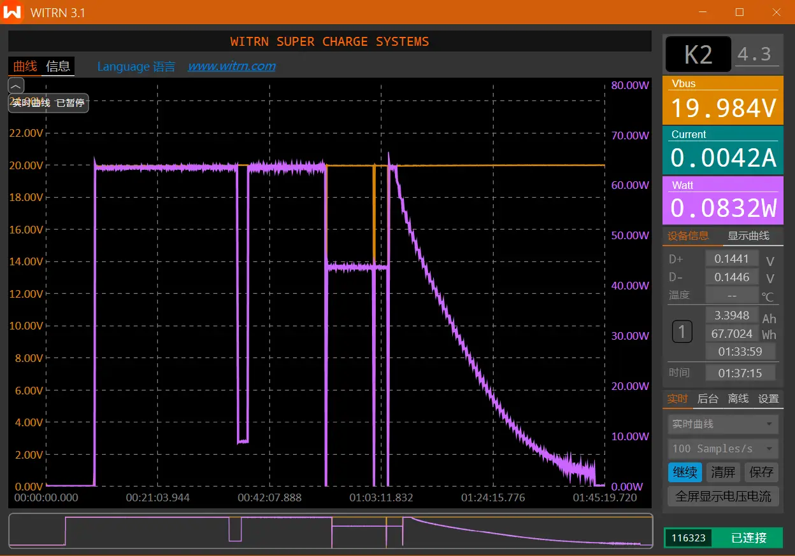 | 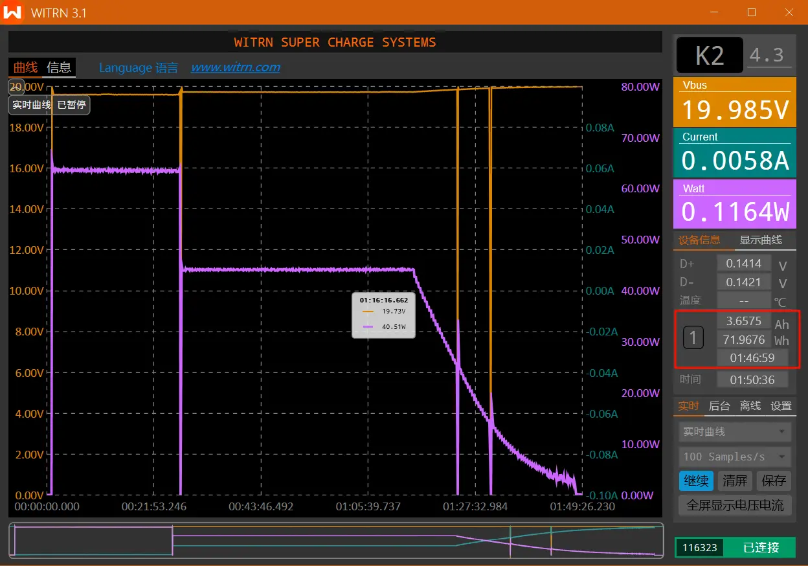 |  
| ----------------------------------------------- | ----------------------------------------------- | --------------------------------------------- |  

利用维简 K2 功率表，测试 3 次情况如上，整体来说充电时间大差不差，功率情况也是受温控影响，涓流时间拉长，冲入能量约为 70Wh 左右。

测试是支持边冲边放，商品详情页未写，所以还是**建议不要这么做**，避免导致发热情况严重。

## 总结

总体来说这是一款平平无奇的充电宝，没有什么出彩的地方，硬说有那也就是对于 OPPO 系和华为系的私有协议支持。没有目前流行的功率大屏，输入功率较低也是硬伤。如果个人有需求的话，200 元以下购入也是可以的。

---

> 作者: 吐司气泡  
> URL: https://blog.toastbubble.top/posts/untpxpv/  

