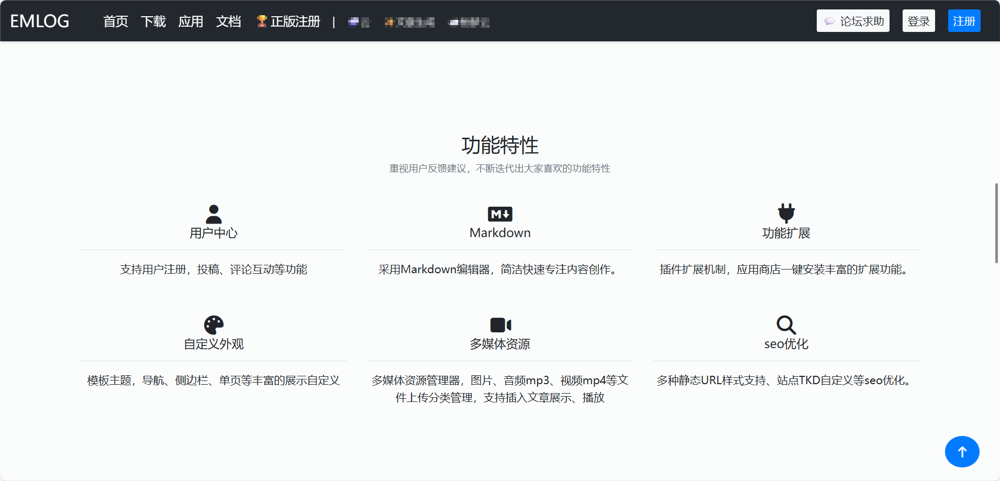
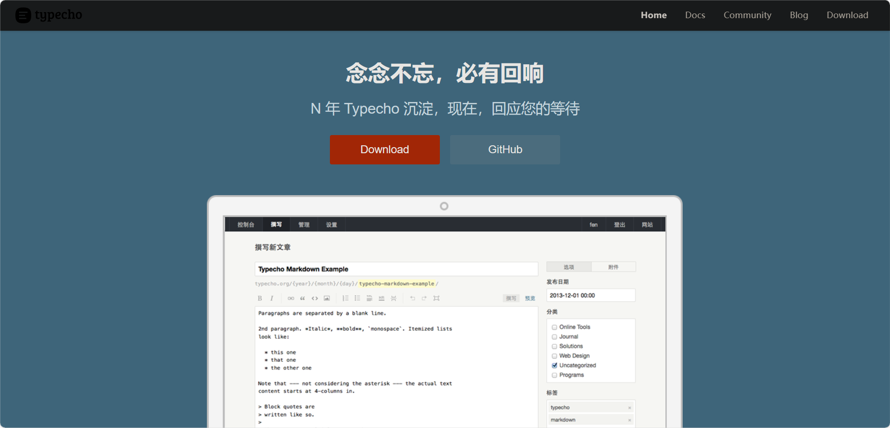
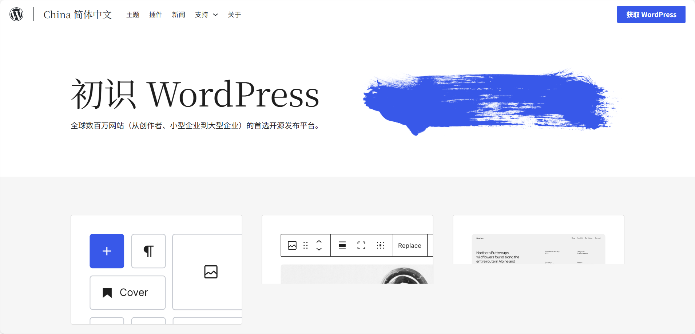

# 我与博客

<!--more-->

  
真正接触博客网站类的还是在高中时期，那时候相应的资金支持购买正规的服务器，而且规避备案问题，买的都是便宜但极易跑路的服务器位于香港的虚拟主机，这种只支持 php 类和静态类博客，第一个安装的就是 Emblog，将压缩包解压到虚拟空间内，建立好数据库，再访问对应的网页进行安装。相对来说也挺方便的，备份时也只需备份数据库文件即可，后续安装可直接导入。

后面文章没写多少，又把博客框架更换为 Typecho。每一次重新安装，都要势必坚持下去，慢慢的因为不知道写什么就搁置了。更换主题若遇到问题需重新安装时就是博客站重新开始之日，不对前面文章感到惋惜。

  
再接着又把框架更换为 Wordpress，现在我也想不起来为什么要更换为这个。可能觉得这个相对于前两个知名度更高吧，毕竟谁也无法知晓那个时候到底在想什么。依旧是无内容产出褒姒。

其实吧写了这么一点貌似就把我之前的内容讲完了，最后换为 Hugo 而不是 Hexo 因为 nodejs 搞起来是有一点费劲的，Hugo 相对来说无论是新建文章还是预览网站都很简单，直接一行命令搞定。主题`Fixit`的作者文档写的很详细，几乎全方位覆盖完全不用担心。

目前来看，还是想到什么写什么，当然尽可能去统一风格，积累经验使得文章更上一层楼，站点时间更长一点八。

---

> 作者: 吐司气泡  
> URL: https://blog.toastbubble.top/posts/wbrk59a/  

