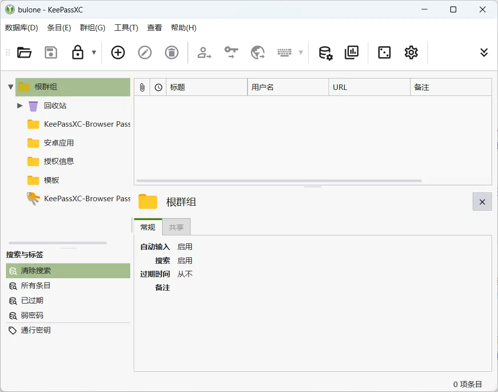
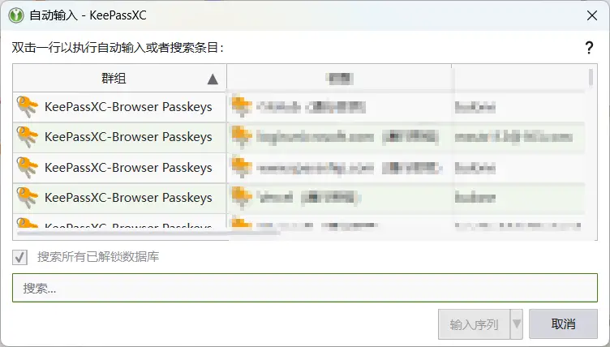
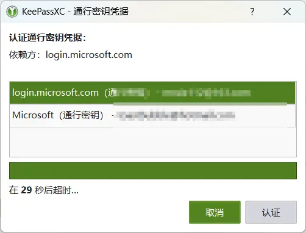
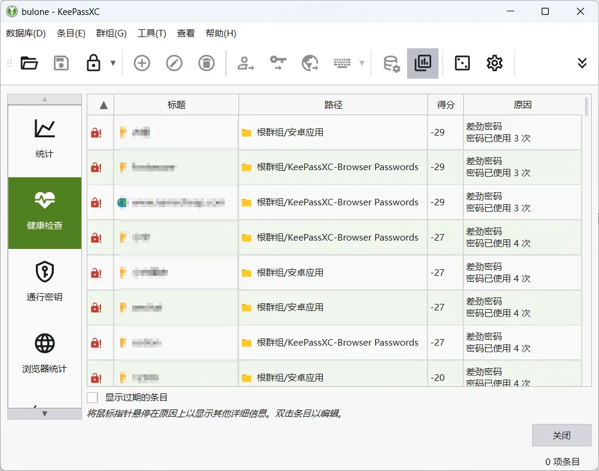

# 密码管理方案

<!--more-->
不同网站应用都需要账户密码，若均使用相同的密码，那么如果一处出现泄露则会导致其他的账户安全性。如果针对不同网站设置不同的密码，则有可能把自己给防住。可能会使用一些便签类软件去进行记载但是很麻烦。所以一个密码管理软件就十分的有必要了。

最先开始使用的是 Safeincloud，整体使用下来还行，电脑移动端都有相关配套软件，可最后还是选择了开源的 Keepass 相关软件。  
电脑端：KeepassXC  
移动端：Keepass2Android  
网页端：KeepassXC-Web  
  
不过有点遗憾的是 KeepassXC 不支持打开远程文件，对于多段同步来说是一个减分项，不过电脑端可以来利用坚果云客户端将文件挂载到本地盘在进行打开即可，移动端的可以直接利用 Webdav 进行访问修改文件，坚果云对于无 Vip 用户的 Webdav 权益足以保证正常情况下的同步使用。

在电脑上 可以设置快捷键调用 KeepassXC 进行选择并自动输入，移动端在符合规范的输入框调用 Keepass2Android 的自动填充服务，如果没有出现的话可以打开其自带的键盘进行选择条目填充。网页端配置连接客户端即可，对于无法读取输入框的情况，可以手动设定填充的那部分。  

KeepassXC 支持 Passkey 通行密钥，在网页端使用时需要将插件连接到客户端才能进行保存读取，否则会出现错误。  
  
KepassXC 还有数据库报告功能，针对你的密码文件进行健康度检查，并根据得分进行条目排序，可自行选择是否修改。  

相较于 Bitwarden 可自行搭建服务端程序，keepass 类型的相关软件大部分都是本地化保存文件，金大可能保证数据安全，不过对于多端同步来说，还是相对于比较麻烦的，不过利用相对可靠的 Webdav 云盘，安全性上也能进一步得保证，密码文件的主密码尽量设置的复杂点。

---

> 作者: 吐司气泡  
> URL: https://blog.toastbubble.top/posts/xqiqdjq/  

