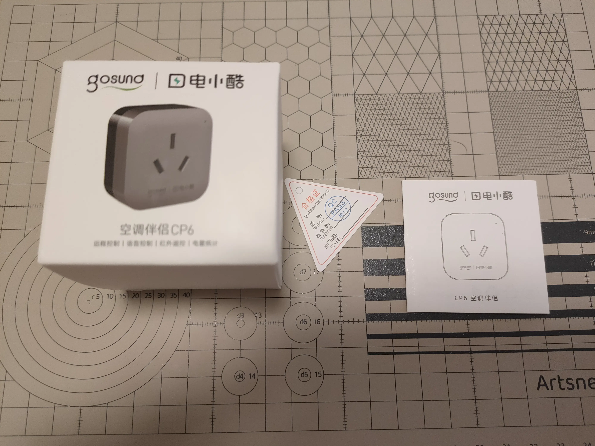
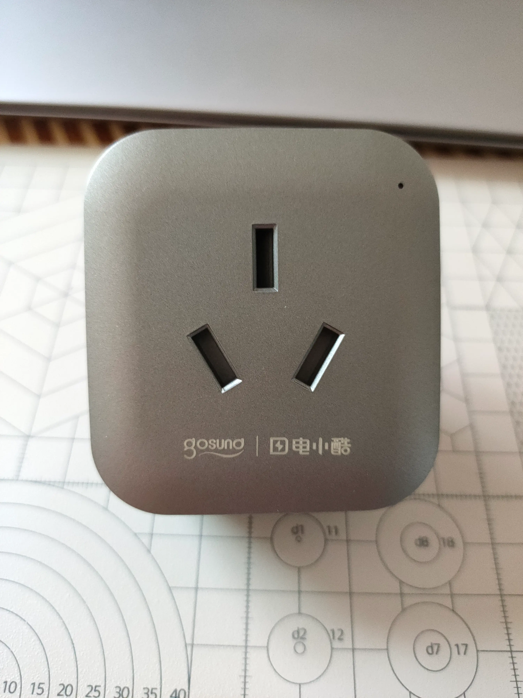
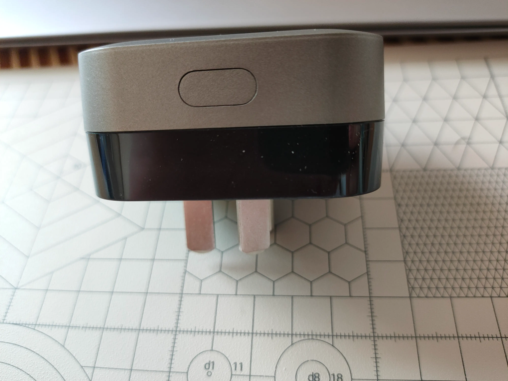
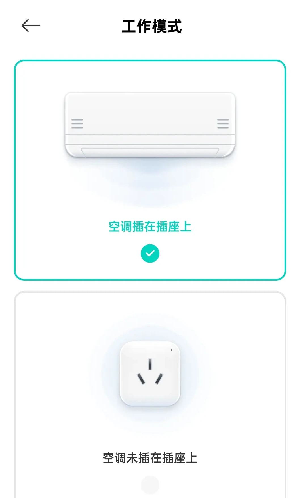
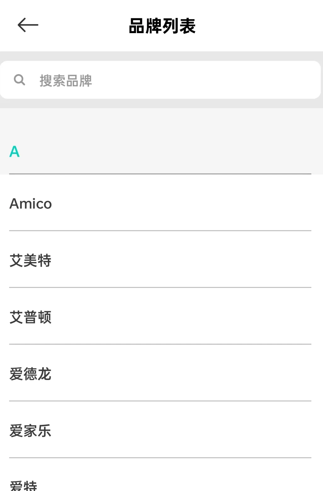
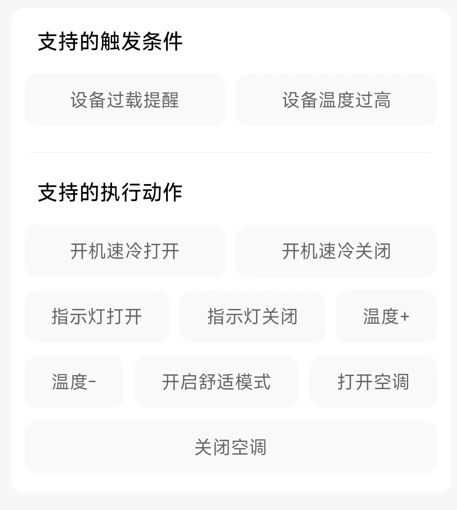
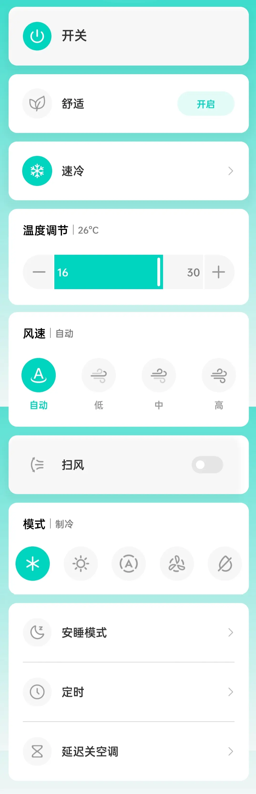
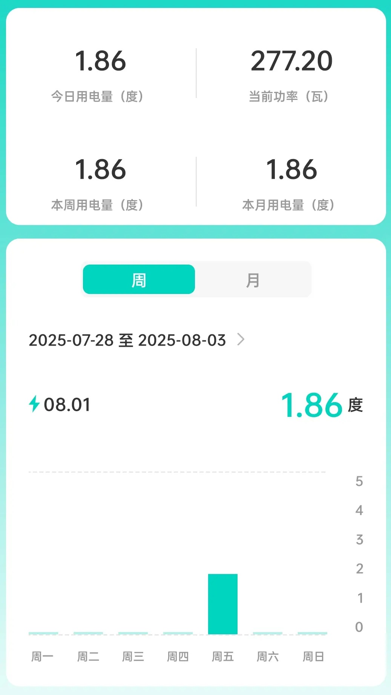
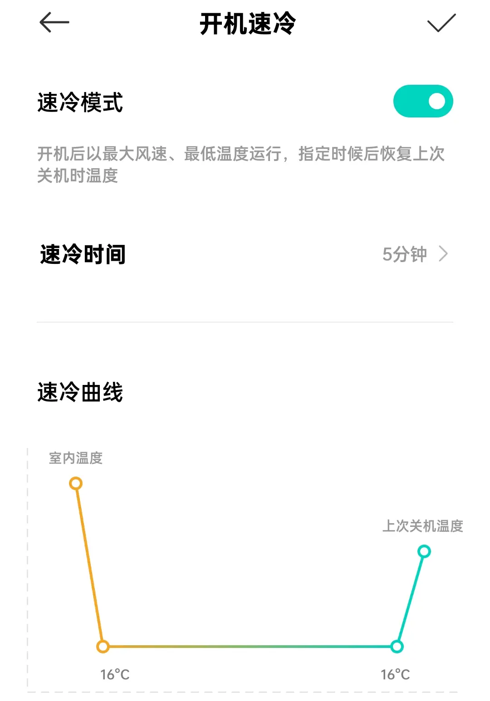
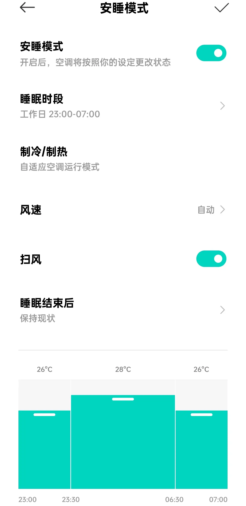

# 电小酷空调伴侣CP6

<!--more-->

现在用的空调是几年前买的了，当时买的时候也并没有太关注智能方面，每次使用的时候都是用遥控器开关，这个遥控器也是十分的“节省”，没有显示屏，对于调整只能看空调上面的显示面板状态。所以打算买个空调伴侣查看功率，耗电情况等增加智能方式。

网上的空调伴侣品牌并不是很多，选来选去也就那几个。对比之后买了电小酷的空调伴侣 CP6（一以下简称该产品），选择它的原因无非支持米家、价格合适以及功能也差不多都有，到手使用后写一下使用体验。

## 外观

包装盒整体十分小巧，大小就比插座大了一点。里面的内容也很简单，就插座本体、合格证以及说明书。

该产品有两种颜色一种是封面的白色版本，一种是下图的灰色版本。在购物平台上白色版本比灰色版本贵几块钱，因为插座是暗金色的所以选择了灰色版本。整体圆润正面下方是品牌名，侧面为配网键，不过这个配网键有点松胯，这一点真的很掉分。

|  |  |
| ------------------------------------------------- | ----------------------------------------------- |

## 使用

手机先在 [官网](https://home.mi.com/) 或应用商店或扫描包装二维码下载米家 APP。插座插在墙面 16A 插座上，启动默认处于配对模式。在米家 APP 中首页右上角添加设备，根据提示打开位置信息，蓝牙稍等一会点击出现的电小酷 CP6，没出现的话手动搜索添加，添加是需要连接 2.4g WiFi，WiFi 名称尽量不要使用中文/特殊符号，以防配置失败。

网络配置好后会让选择如下工作模式，因为带有红外遥控，所以两种模式使用下来的区别就是能否查看功率和耗电量，其他开关之类的还是可以使用的。注意因为是红外遥控，所以要避免遮挡导致无法使用。

品牌选择内选择所要控制的空调品牌，整体看下来品牌挺多的，其红外库涵盖量应该还是可以的。因为不能主动学习，所以如果不能控制您家品牌空调，则即使选择退货处理。

|  |  |
| ------------------------------------------------- | ------------------------------------------------- |

## 功能

整体设备的功能如下图所示，部分配对品牌有空调灯光关闭功能（可惜我这品牌两个红外库都没有此功能）。

能够查看 " 当前 " 耗电和功率，使用下来大约 5 分钟同步数据（如果不对还请指出），**没有功率曲线图功能**。

|  |  |  |   |
| ------------------------------------------------- | --------------------------------------------------- | ------------------------------------------------- | ----------------------------------------------------- |

这个开机速冷功能我还是挺喜欢的，开机时选择最大风速最低温度尽可能的加速室温降低，再调整为上一次的关机温度，与网上的省电方法有一定的相似。

睡眠模式就是简单的如图所示，睡觉前期选择稍低合适温度更好的进入梦乡，睡觉中期可以选择高一点的温度节省电量。三个阶段可以手动选择合适温度，睡眠省电都照顾到。

## 总结

综上，这款空调伴侣该有的功能都是有的，不过在一些小细节上可能还是比不过小米空调伴侣 2。不过二者的价钱上差距还是很明显的，况且空调伴侣 2 貌似还涨价了。如果你仅仅选择如上述功能的话，那么电小酷 CP6 是个不错的选择，稍微加点上空调伴侣 2 也不失为一种更好的策略。

如果有什么相关问题的话可以留言，共同讨论。

| 功能     | 可行  |
| ------ | --- |
| 开关空调   | ✔️  |
| 红外学习   | ✖️  |
| 空调运行感知 | ❓   |

---

> 作者: 吐司气泡  
> URL: https://blog.toastbubble.top/posts/xsf6xyv/  

